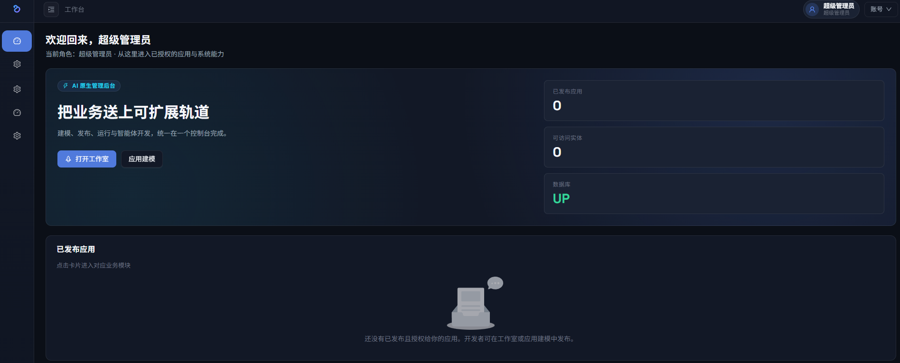
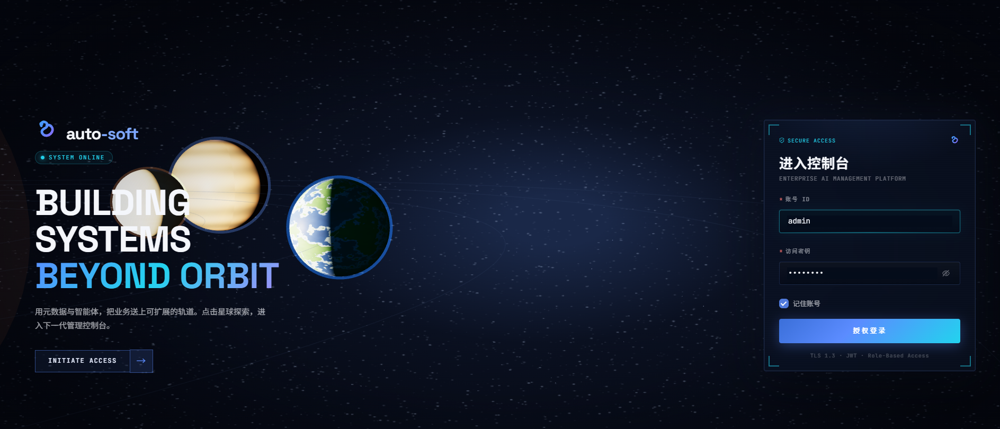

# auto-soft

AI 管理后台：用户通过自然语言与系统对话，即可生成自己需要的后台功能（动态 CRUD + 审批流）。

打开前端进入太阳系登录页；默认账号见 [docs/dev-setup.md](docs/dev-setup.md)。整体计划见 [docs/分阶段开发计划.md](docs/分阶段开发计划.md)。


## 目录总览

```
auto-soft/
├── docs/                 # 设计文档、接口、数据库约定、开发规范
├── dev/                  # Java / Spring Boot 4 后端（Maven 多模块）
├── web/                  # Vue 3 + Vite + TypeScript 前端
├── docker-compose.yml    # 本地 PostgreSQL 16
├── .editorconfig
└── README.md
```

| 目录 | 说明 |
| --- | --- |
| `docs/` | 产品概览、分阶段计划、API、数据库、本地启动 |
| `dev/` | 后端唯一代码树；`auto-soft-boot` 为启动模块 |
| `web/` | 前端 SPA；开发端口 `5173`，代理 `/api` 到 `8080` |

## 后端 `dev/`

Maven 父工程 `com.autosoft:auto-soft`，依赖只能向下，`boot` 是唯一聚合启动点。

```
dev/
├── pom.xml
├── auto-soft-common/       # 统一返回、异常、分页、常量
├── auto-soft-framework/    # Web、安全、JWT、MyBatis、TraceId
├── auto-soft-system/       # 登录、用户、角色、菜单、操作日志
├── auto-soft-meta/         # 元数据建模、DDL、动态 CRUD 运行时、发布
├── auto-soft-agent/        # 功能开发工作室、LLM、Agent 工具
├── auto-soft-flow/         # warm-flow 封装、待办/已办、实体绑定流程
├── auto-soft-workflow/     # 自动化工作流 DAG（阶段 6A）
└── auto-soft-boot/         # 启动类、配置、Flyway 迁移、健康检查
```

### 模块职责

| 模块 | 包根 | 职责 |
| --- | --- | --- |
| `auto-soft-common` | `com.autosoft.common` | `R`、`ResultCode`、`BizException`、分页、角色码 |
| `auto-soft-framework` | `com.autosoft.framework` | Security、JWT、全局异常、审计字段、`@OperLog` |
| `auto-soft-system` | `com.autosoft.system` | `/api/auth`、用户/角色/菜单、操作日志 |
| `auto-soft-meta` | `com.autosoft.meta` | 应用/实体/字段、发布建表、`/api/runtime` |
| `auto-soft-agent` | `com.autosoft.agent` | Studio 会话流、LLM 配置、工具调用 |
| `auto-soft-flow` | `com.autosoft.flow` | 流程绑定、提交、待办已办 |
| `auto-soft-workflow` | `com.autosoft.workflow` | 自动化工作流 DAG、试跑与发布运行 |
| `auto-soft-boot` | `com.autosoft` / `com.autosoft.boot` | `AutoSoftApplication`、Flyway、`/api/health` |

### 代码结构（按包）

```
auto-soft-common
└── com.autosoft.common
    ├── core/                 # R、ResultCode、PageQuery、RoleCodes
    ├── exception/            # BizException
    └── utils/

auto-soft-framework
└── com.autosoft.framework
    ├── config/               # Jackson、WebMvc
    ├── log/                  # @OperLog
    ├── mybatis/              # 审计填充、MP 配置
    ├── security/             # JWT Filter、权限切面、SecurityConfig
    │   └── jwt/
    └── web/                  # 全局异常、TraceId

auto-soft-system
└── com.autosoft.system
    ├── auth/                 # 登录、密码、LoginUserLoader
    ├── user/  role/  menu/   # 业务服务
    ├── log/                  # 操作日志切面与查询
    ├── entity/ mapper/ dto/ vo/
    └── web/                  # AuthController、User/Role/Menu/OperLog

auto-soft-meta
└── com.autosoft.meta
    ├── app/                  # MetaCatalogService
    ├── ddl/                  # DdlManager、Identifiers（dyn_* 表）
    ├── field/                # FieldTypes
    ├── publish/              # PublishService
    ├── runtime/              # RuntimeService、RuntimeSqlManager、流程钩子
    ├── entity/ mapper/ dto/ vo/
    └── web/                  # MetaAppController、RuntimeController

auto-soft-agent
└── com.autosoft.agent
    ├── studio/               # AgentService、会话、Prompt
    ├── llm/                  # 协议路由、OpenCode Go / Anthropic / Chat Completions
    ├── tool/                 # AgentTool 注册与实现（建应用/字段/发布等）
    ├── crypto/               # LLM Key AES-GCM
    ├── config/ entity/ mapper/ dto/ vo/
    └── web/                  # StudioController、LlmConfigController

auto-soft-flow
└── com.autosoft.flow
    ├── FlowManager.java
    ├── web/                  # FlowTodoController
    └── entity/ mapper/ dto/ vo/

auto-soft-workflow
└── com.autosoft.workflow
    ├── graph/                # IR、Validator
    ├── exec/                 # Executor、节点
    ├── def/                  # 草稿与发布
    └── web/                  # WorkflowController

auto-soft-boot
├── src/main/java/com/autosoft/AutoSoftApplication.java
├── src/main/java/com/autosoft/boot/health/
└── src/main/resources/
    ├── application.yml
    ├── application-dev.yml
    └── db/migration/
        ├── V1.0.0__init.sql
        ├── V1.1.0__sys_user_role.sql
        ├── V1.2.0__meta_engine.sql
        ├── V1.3.0__ai_studio.sql
        ├── V1.4.0__warm_flow.sql
        └── V1.5.0__sys_oper_log.sql
```

动态业务表命名：`dyn_{appCode}_{entityCode}`，仅在发布时由 `DdlManager` 创建。

## 前端 `web/`

Vue 3 + Vite + TypeScript + Pinia + Ant Design Vue 4 + Three.js。

```
web/
├── package.json
├── vite.config.ts            # 开发代理 /api → 127.0.0.1:8080
└── src/
    ├── main.ts               # 入口：Pinia、路由守卫、Antd、暗色主题
    ├── App.vue               # ConfigProvider
    ├── api/                  # HTTP 客户端与各域接口
    ├── router/               # 路由表、登录守卫
    ├── stores/               # auth、app
    ├── layouts/              # AdminLayout、BlankLayout
    ├── components/
    │   ├── layout/           # PageShell
    │   └── schema/           # SchemaRenderer / Form / Table（动态页）
    ├── styles/               # Design Token、暗色主题、global.css
    ├── utils/                # token（sessionStorage，按标签页隔离）
    └── views/
        ├── login/            # 登录页 + SolarSystemCanvas
        ├── dashboard/        # 工作台
        ├── studio/           # 功能开发（对话 + 预览）
        ├── meta/             # 应用建模
        ├── runtime/          # /app/:app/:entity 动态运行时
        ├── system/           # 用户、角色、LLM、操作日志
        ├── flow/             # 待办 / 已办
        ├── health/
        └── error/            # 403 / 404
```

### 主要路由

| 路径 | 页面 |
| --- | --- |
| `/login` | 登录 |
| `/dashboard` | 工作台 |
| `/studio` | 功能开发工作室 |
| `/meta/apps` | 应用建模 |
| `/app/:app/:entity` | 已发布应用的动态 CRUD |
| `/system/users` `/system/roles` | 用户 / 角色 |
| `/system/llm` `/system/logs` | 模型配置 / 操作日志 |
| `/flow/todo` `/flow/done` | 待办 / 已办 |

登录 JWT 存在当前标签页的 `sessionStorage`，新标签页为独立未登录态。「记住账号」只保存用户名。

## 文档 `docs/`

| 文档 | 说明 |
| --- | --- |
| [00-overview.md](docs/00-overview.md) | 产品定位与技术栈 |
| [分阶段开发计划.md](docs/分阶段开发计划.md) | MVP 分期 |
| [dev-setup.md](docs/dev-setup.md) | 本地启动与默认账号 |
| [api.md](docs/api.md) | 稳定接口 |
| [database.md](docs/database.md) | 表约定 |
| [coding-standards.md](docs/coding-standards.md) | 编码规范 |
| [user-guide.md](docs/user-guide.md) | 使用手册 |

## 快速开始

需已安装 JDK 25、Maven 3.9+、Node.js 20+、Docker。

```bash
# 1. 启动 PostgreSQL（开发库，密码仅用于本地）
docker compose up -d

# 2. 启动后端（http://127.0.0.1:8080）
cd dev
mvn -pl auto-soft-boot -am spring-boot:run

# 3. 另开终端启动前端（http://localhost:5173）
cd web
npm install
npm run dev
```

完整步骤与排障见 [docs/dev-setup.md](docs/dev-setup.md)。
