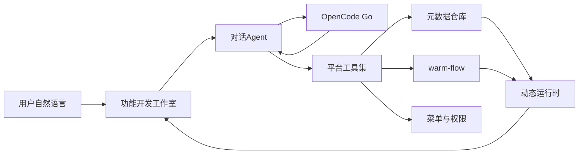

# 产品概览

AI 管理后台：用户仅通过与系统对话，即可生成自己需要的后台功能，缩短「提需求 → 改代码 → 测试 → 上线」的周期。

当前仓库处于 **阶段 0（脚手架与规范）**。登录、权限、功能开发工作室、工作流尚未实现。

## 已确认决策

- **能力边界**：元数据驱动的动态 CRUD + warm-flow 审批流。对话后立刻得到可点可用的页面与流程。MVP **不生成、不写入 Java/Vue 源码文件**。
- **大模型**：OpenCode Go。管理员在系统设置中指定模型，代码仅保留兜底默认（建议 `kimi-k2.7-code`）。
- **目录**：前端 `web/`，后端 `dev/`，设计文档 `docs/`。
- **规范**：阿里巴巴 Java 开发手册；Controller 禁止业务代码；复杂业务主方法只写步骤。

## 产品怎么工作

平台预先提供可复用能力（动态表、动态页面、菜单权限、审批流）。用户在功能开发工作室用自然语言描述需求，Agent 调用这些能力组装功能。左侧对话、右侧预览；发布后菜单立刻可用。

## 技术栈

| 层 | 选型 |
| --- | --- |
| JDK | 21 LTS |
| 后端 | Spring Boot 4.1.x、Spring Security、JWT（阶段 1 起） |
| ORM | MyBatis-Plus（阶段 1 起接入） |
| 工作流 | warm-flow（阶段 4） |
| 数据库 | PostgreSQL 16+，Flyway |
| 前端 | Vue 3、Vite、TypeScript、Ant Design Vue 4、Pinia |
| 登录动效 | Three.js 太阳系（阶段 1） |
| LLM | OpenCode Go（阶段 3） |

## 后端模块

| 模块 | 职责 |
| --- | --- |
| `auto-soft-common` | 统一返回、异常、分页、工具 |
| `auto-soft-framework` | Web、CORS、Jackson、全局异常 |
| `auto-soft-system` | 用户、角色、菜单、系统设置 |
| `auto-soft-meta` | 元数据与动态 CRUD 运行时 |
| `auto-soft-agent` | 对话与 OpenCode Go |
| `auto-soft-flow` | warm-flow 封装 |
| `auto-soft-boot` | 启动模块 |

依赖只能向下。`boot` 是唯一聚合启动点。

更完整的分期与接口规划见 [分阶段开发计划.md](./分阶段开发计划.md)。本地运行见 [dev-setup.md](./dev-setup.md)。
