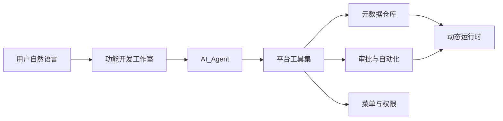
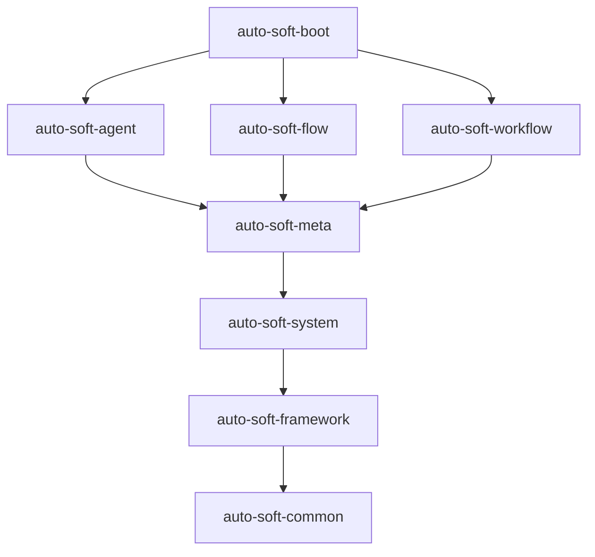

# auto-soft PPT 大纲（业务 / 技术 / 管理）

## 使用说明

- **总页数建议**：共享核心 8 页 + 听众专属 4～6 页 + 结尾 1 页 ≈ **13～15 页**
- **演讲策略**：先讲共享核心（5～6 分钟），再按听众切换专属章节；混合场合可只保留与听众最相关的 2～3 页专属内容
- **视觉建议**：暗色主题呼应产品 UI；流程页用 mermaid/架构图；演示页配 Studio 左右分栏截图

---

## Part A：共享核心（三类听众均适用）

### 第 1 页｜封面

- **标题**：auto-soft — AI 驱动的管理后台平台
- **副标题**：用自然语言描述需求，分钟级生成可用的后台功能
- **演讲要点**：一句话定位，不展开技术细节

### 第 2 页｜我们面对的问题

- **标题**：传统后台开发的痛点
- **要点**：
  - 提需求 → 改代码 → 联调 → 上线，周期长
  - 请假单、报销单、合同登记等需求 **80% 结构相似**，却重复开发
  - 业务等 IT、IT 堆需求，响应速度成为瓶颈
- **演讲要点**：用业务语言描述痛点，三类听众都能共鸣

### 第 3 页｜auto-soft 的答案

- **标题**：不是让 AI 写代码，而是让 AI 组装能力
- **要点**：
  - 平台预先内置：动态表、动态页、菜单权限、审批流、自动化工作流
  - 用户用自然语言描述需求，AI Agent 调用工具 **组装** 功能
  - 发布后菜单立刻出现，数据立刻可增删改查
- **金句**：「对话 → 预览 → 发布 → 立刻可用」

### 第 4 页｜产品怎么工作（总览）

- **标题**：一条流水线，端到端闭环
- **流程图**（建议放页内）：

- **演讲要点**：强调「组装」而非「生成源码」

### 第 5 页｜核心能力一览

- **标题**：五大能力模块
- **要点**（图标 + 一句话）：
  1. **功能开发工作室** — 左侧对话、右侧实时预览
  2. **动态 CRUD** — 发布后自动生成列表/表单/详情
  3. **单线审批流** — 填单 → 提交 → 待办 → 通过/驳回
  4. **自动化工作流（DAG）** — 条件分支、试跑、定时/HTTP 触发
  5. **全局 AI 助手** — 找菜单、查操作、跨会话记忆
- **演讲要点**：Studio 与助手职责分离，一笔带过

### 第 6 页｜典型场景演示（请假审批）

- **标题**：三分钟做一个请假审批系统
- **步骤**（时间轴或分步图）：
  1. 开发者登录 → 进入「功能开发」
  2. 输入：「做请假单，字段请假天数、原因，提交后 ADMIN 审批」
  3. AI 确认字段 → 右侧预览列表与表单
  4. 点击发布 → 菜单出现
  5. 普通用户填单提交 → 管理员待办审批
- **演讲要点**：全程未改一行 Java/Vue（为技术/管理页埋伏笔）

### 第 7 页｜角色与协作

- **标题**：谁用什么、怎么分工
- **表格**：

| 角色 | 典型使用者 | 主要能力 |
| --- | --- | --- |
| 超级管理员 | IT 负责人 | 用户/角色、LLM 配置、全站管理 |
| 管理员 | 部门主管 | 用户管理、审批待办 |
| 开发者 | 业务分析师 / 低代码开发 | 应用建模、功能开发工作室 |
| 普通用户 | 一线员工 | 填单、提交、查看 |

- **演讲要点**：降低对专业开发的依赖，业务侧也能参与建模

### 第 8 页｜设计哲学（一页讲透）

- **标题**：元数据 + 运行时，而非代码生成
- **对比表**：

| 维度 | 传统 AI 写代码 | auto-soft 元数据路线 |
| --- | --- | --- |
| 产出物 | Java/Vue 源码文件 | 元数据 + 动态表 + Schema |
| 可控性 | 难审计、难回滚 | 发布流程、操作日志、权限隔离 |
| 上线速度 | 仍需编译部署 | 发布即生效 |
| 安全 | LLM 可任意写逻辑 | Agent 仅调用注册工具，SQL 白名单 |

- **演讲要点**：这是面向管理层的「为什么可信」页，也是技术层的「架构决策」页

---

## Part B：业务听众专属（4 页）

> **适用对象**：业务分析师、产品经理、部门需求方、低代码使用者  
> **演讲侧重**：怎么用、解决什么业务问题、演示路径

### 第 B1 页｜业务价值

- **标题**：对业务方意味着什么
- **要点**：
  - **响应快**：需求当天描述、当天预览、当天可用
  - **自助化**：简单表单 + 审批不必排队等开发排期
  - **可迭代**：字段调整、流程变更通过对话 + 重新发布完成
  - **零代码门槛**：自然语言即可，无需懂 Java/Vue

### 第 B2 页｜三种提需求方式

- **标题**：从易到难，总有一种适合你
- **要点**：
  - **路径 A（推荐）**：功能开发工作室 — 自然语言描述，AI 全自动
  - **路径 B（兜底）**：应用建模 — 手工建 app / 实体 / 字段
  - **路径 C（进阶）**：自动化工作流 — 描述业务规则，生成可编辑流程图
- **示例话术**（放页内引用框）：
  - 请假单：「字段请假天数、原因，ADMIN 审批」
  - 合同提醒：「金额大于 1000 走提醒，否则结束」

### 第 B3 页｜业务用户日常使用

- **标题**：发布之后，一线员工怎么用
- **要点**：
  - 登录后在菜单找到对应功能（或由 AI 助手导航：「XX 在哪里？」）
  - 动态页填写 → 保存 → 提交（若绑流程）
  - 审批中/已通过状态只读；驳回后可修改再提交
  - 管理员在「待办中心」处理审批

### 第 B4 页｜全局 AI 助手（业务视角）

- **标题**：随身的后台导航员
- **要点**：
  - 找菜单：「用户管理在哪里？」→ 可点击跳转
  - 查自己的操作：「我昨天有没有新增过用户？」
  - 记住偏好：「我叫张三，负责财务」→ 新会话仍记得
  - **不会** 改应用结构 — 与功能开发工作室分工明确

---

## Part C：技术听众专属（5 页）

> **适用对象**：架构师、后端/前端开发、DevOps、安全审计  
> **演讲侧重**：架构决策、模块划分、安全与扩展性

### 第 C1 页｜技术栈总览

- **标题**：现代化全栈架构
- **表格**：

| 层 | 选型 |
| --- | --- |
| 后端 | Spring Boot 4.1、Java 25、MyBatis-Plus |
| 前端 | Vue 3、Vite、TypeScript、Ant Design Vue 4、Pinia |
| 数据库 | PostgreSQL 16、Flyway 迁移 |
| 工作流 | warm-flow（单线审批）+ 自研 DAG 引擎 |
| LLM | OpenCode Go（Chat / Anthropic / Responses 多协议路由） |
| 其他 | JWT、SSE 流式对话、pgvector 记忆、Three.js 登录页 |

### 第 C2 页｜后端模块架构

- **标题**：Maven 多模块，依赖单向
- **模块图**（建议放页内）：

- **各模块职责**（简要列表）：
  - `meta` — 元数据、DDL（`dyn_*` 表）、动态 CRUD 运行时
  - `agent` — LLM 接入、Agent 工具循环、Studio/Assistant 会话
  - `flow` — warm-flow 封装、待办/已办
  - `workflow` — DAG 自动化、试跑与发布
  - `system` — 用户/角色/菜单/操作日志

### 第 C3 页｜元数据引擎与动态运行时

- **标题**：核心机制 — 不生成源码，如何跑起来
- **要点**：
  - 元数据定义 app / entity / field / page schema
  - 发布时 `DdlManager` 创建 `dyn_{appCode}_{entityCode}` 表（只 CREATE / ADD COLUMN）
  - 运行时统一 API：`/api/runtime/{app}/{entity}/page|POST|PUT|DELETE|submit`
  - 前端 `SchemaRenderer` 根据 JSON Schema 动态渲染列表/表单
  - 列名、排序字段来自元数据白名单，禁止拼接用户输入为 SQL 标识符

### 第 C4 页｜AI Agent 与工具集

- **标题**：Agent 如何安全地「组装」功能
- **要点**：
  - Studio 会话：SSE 流式对话 → LLM 返回 tool_call → `ToolRegistry` 执行 → 结果回传 LLM
  - 注册工具示例：`create_app`、`define_entity`、`add_field`、`bind_flow`、`publish` 等
  - Assistant 会话：**只读工具**（`search_menus`、`query_my_operations`、记忆读写），禁止写库
  - API Key AES-GCM 加密存储；权限不进 JWT，每次查库

### 第 C5 页｜前端架构要点

- **标题**：Schema 驱动 + 模块化视图
- **要点**：
  - 路由：`/studio`（工作室）、`/app/:app/:entity`（动态运行时）、`/flow/todo`（待办）
  - 组件：`SchemaRenderer` / `LowCodeRenderer` 动态页；`AssistantPanel` 全局助手
  - 开发代理：`/api` → `127.0.0.1:8080`；JWT 存 sessionStorage（按标签页隔离）
  - 目录结构：`web/src/views/` 按域划分（studio、runtime、flow、system）

---

## Part D：管理听众专属（4 页）

> **适用对象**：CTO、IT 总监、部门负责人、采购/决策层  
> **演讲侧重**：ROI、效率、风险可控、落地路径

### 第 D1 页｜管理价值与 ROI

- **标题**：投入产出：为什么值得做
- **要点**：
  - **缩短交付周期**：重复 CRUD + 审批从「周级」压缩到「小时级」
  - **释放开发资源**：专业开发聚焦复杂系统，简单后台交给平台 + 业务自助
  - **降低沟通成本**：需求即对话，预览即验收，减少「理解偏差 → 返工」
  - **可量化**：同类需求复用平台能力，边际成本递减

### 第 D2 页｜风险可控

- **标题**：AI 不是黑盒 — 企业级管控设计
- **要点**：
  - Agent **不能** 任意执行 SQL 或写源码，仅调用注册工具
  - 发布需二次确认；操作全程记入操作日志
  - 角色权限分离：谁能建模、谁能审批、谁能看数据
  - LLM Key 集中管理、加密存储；HTTP 调用白名单
  - 动态表命名规范、DDL 只增不删，数据可保留

### 第 D3 页｜组织落地建议

- **标题**：如何在团队内推广
- **要点**：
  - **角色分工**：IT 配模型与权限 → 开发者/业务分析师建模 → 管理员审批 → 员工使用
  - **试点场景**：选 1～2 个高频、结构简单的流程（请假、报销、设备领用）
  - **推广路径**：试点验证 → 模板沉淀 → 扩大至更多部门
  - **配套**：超管配置 OpenCode Go API Key；默认模型建议 `kimi-k2.7-code`

### 第 D4 页｜与现有 IT 体系的关系

- **标题**：补位，而非替代
- **要点**：
  - 适合：标准 CRUD + 单线审批 + 简单自动化规则
  - 与 ERP/OA/自研系统：**并行共存**，处理长尾、快速变化的需求
  - 技术栈主流（Spring Boot、Vue、PostgreSQL），便于现有团队接手运维
  - 本地可 Docker 一键起库，开发/演示环境部署门槛低

---

## Part E：结尾（共享）

### 第 E1 页｜总结与行动号召

- **标题**：auto-soft — 让后台开发从「写代码」变成「组装能力」
- **三句话总结**：
  1. 用户自然语言描述需求，AI 调用平台工具组装功能
  2. 元数据 + 运行时路线，发布即生效，安全可控
  3. 功能开发工作室 + 审批流 + 自动化工作流 + 全局助手，覆盖从建模到使用的全链路
- **行动号召**（按场合选一句）：
  - 业务场合：「我们可以现场演示，三分钟做一个请假审批」
  - 技术场合：「欢迎看代码仓库与模块划分，一起讨论扩展点」
  - 管理场合：「建议选一个简单的试点场景，两周内看到效果」

---

## 场合组合建议

| 场合 | 推荐页序 | 时长 |
| --- | --- | --- |
| 业务演示会 | A 全部 + B 全部 + E | 10～12 分钟 |
| 技术分享 / 架构评审 | A 全部 + C 全部 + E | 15～18 分钟 |
| 管理层汇报 / 立项 | A（精简 6 页）+ D 全部 + E | 8～10 分钟 |
| 综合路演 | A 全部 + B1/B2 + C2/C3 + D1/D2 + E | 15 分钟 |

## 可选附录（不计入主大纲）

- 附录 1：登录页 Three.js 太阳系（产品细节，30 秒带过）
- 附录 2：自动化工作流 DAG 试跑演示（技术/业务进阶）
- 附录 3：本地快速启动命令（技术听众 Q&A 用）
