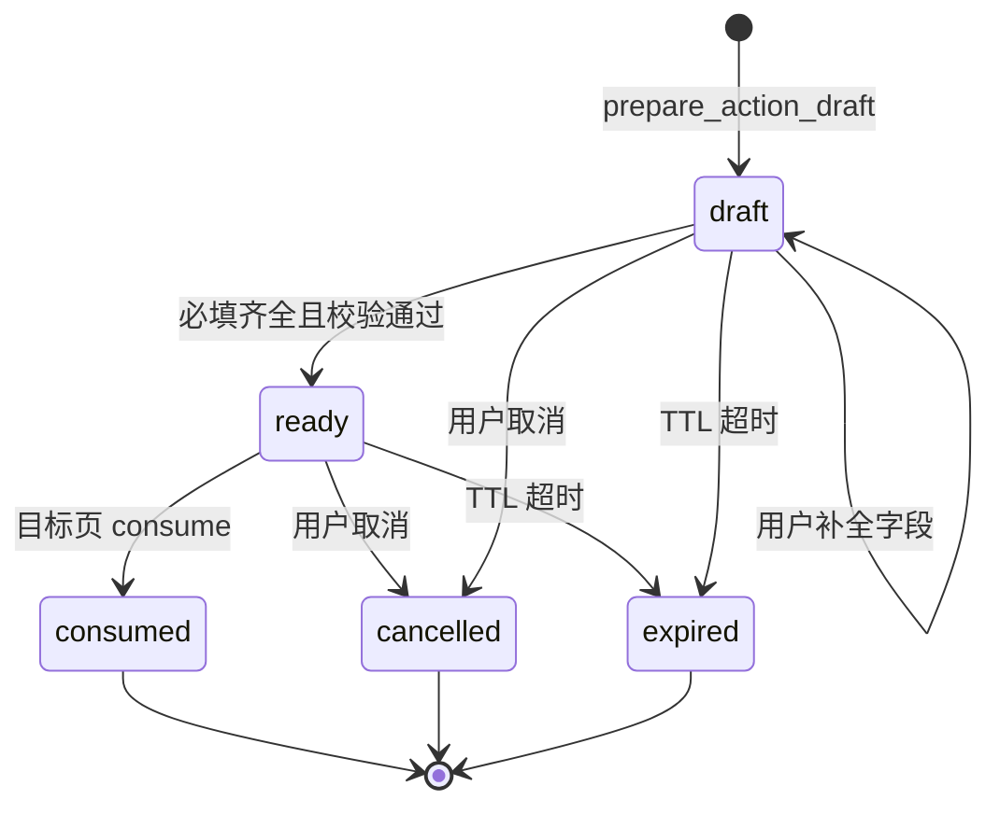

# 助手操作 Copilot 实现规格

> 文档日期：2026-09-02  
> 范围：阶段 8 P0（系统用户新建 + 动态 CRUD 新建）  
> 状态：**P0 已实现**  
> 主设计见 [../阶段8-助手操作Copilot.md](../阶段8-助手操作Copilot.md)

本文描述阶段 8 的 **Capability 发现、ActionDraft、SSE、API、DDL** 等实现细节。编码时以本文与主设计为准；落地后更新 [../api.md](../api.md)、[../database.md](../database.md)。

---

## 1. Capability ID 规范

### 1.1 格式

| 类型 | ID 格式 | 示例 |
| --- | --- | --- |
| 系统内置 | `system.{module}.{operation}` | `system.user.create` |
| 动态运行时 | `runtime.{appCode}.{entityCode}.{operation}` | `runtime.leave.leave.create` |

P0 仅支持 `operation = create`。

### 1.2 P0 内置枚举

| capabilityId | label | path | permission | targetType |
| --- | --- | --- | --- | --- |
| `system.user.create` | 新建系统用户 | `/system/users` | `system:user:create` | `system_modal` |

`runtime.*.create` 由 `CapabilityDiscoveryService` 按已发布 `meta_app` + `meta_entity` 动态生成，不手工维护。

### 1.3 targetType

| 值 | 消费方 | 说明 |
| --- | --- | --- |
| `system_modal` | `UserView.vue` 等 | 打开页面内 Modal 并预填 |
| `runtime_form` | `SchemaRenderer.vue` | 打开新增 Modal 并预填 `form` |

---

## 2. CapabilityDefinition 结构

### 2.1 JSON Schema（逻辑模型）

```json
{
  "capabilityId": "system.user.create",
  "label": "新建系统用户",
  "description": "在系统用户管理中创建账号",
  "path": "/system/users",
  "permission": "system:user:create",
  "targetType": "system_modal",
  "modalKey": "userCreate",
  "operation": "create",
  "apiMethod": "POST",
  "apiPath": "/api/users",
  "keywords": ["用户", "账号", "系统用户", "用户管理"],
  "fields": [
    {
      "key": "username",
      "label": "用户名",
      "type": "string",
      "required": true,
      "pattern": "^[a-zA-Z][a-zA-Z0-9_]{3,31}$",
      "hint": "以字母开头，4-32 位字母数字下划线"
    },
    {
      "key": "password",
      "label": "密码",
      "type": "string",
      "required": true,
      "sensitive": true,
      "pattern": "^(?=.*[A-Za-z])(?=.*\\d).{8,32}$",
      "hint": "8-32 位且包含字母和数字"
    },
    {
      "key": "nickname",
      "label": "昵称",
      "type": "string",
      "required": true
    },
    {
      "key": "roleIds",
      "label": "角色",
      "type": "role_ref",
      "required": true,
      "multi": true
    },
    {
      "key": "status",
      "label": "状态",
      "type": "int",
      "required": false,
      "default": 1,
      "enum": [0, 1]
    }
  ]
}
```

### 2.2 字段 type 枚举

| type | 校验来源 | 备注 |
| --- | --- | --- |
| `string` | pattern / length | 对齐 DTO 或 `meta_field` |
| `int` / `decimal` | 数值范围 | runtime 来自 `fieldType` |
| `datetime` | ISO 或 dayjs 格式 | runtime date/datetime |
| `enum` | optionsJson 或固定 enum | |
| `role_ref` | `RoleService` 名称→ID | 禁止 LLM 直接填 ID |
| `bool` | 0/1 | |

### 2.3 动态 CRUD 字段映射（MetaFieldVO → CapabilityField）

| MetaFieldVO | CapabilityField |
| --- | --- |
| `code` | `key` |
| `name` | `label` |
| `fieldType` | `type`（映射表见主设计 5.1） |
| `requiredFlag == 1` | `required: true` |
| `nullableFlag == 0` | `required: true` |
| `defaultValue` | `default` |
| `optionsJson` | `enum` / select options |

系统字段 `id`、`created_at` 等不参与 create draft。

---

## 3. ActionDraft 结构

### 3.1 状态机



| status | 含义 |
| --- | --- |
| `draft` | 缺必填或待补全 |
| `ready` | 可「确认并前往」 |
| `consumed` | 目标页已加载并消费 |
| `cancelled` | 用户或会话放弃 |
| `expired` | 超过 `expires_at` |

### 3.2 JSON 响应模型

```json
{
  "draftId": "550e8400-e29b-41d4-a716-446655440000",
  "sessionId": 42,
  "capabilityId": "system.user.create",
  "status": "ready",
  "label": "新建系统用户",
  "targetPath": "/system/users",
  "targetType": "system_modal",
  "modalKey": "userCreate",
  "permission": "system:user:create",
  "values": {
    "nickname": "A",
    "roleIds": [2],
    "status": 1
  },
  "displayValues": {
    "nickname": "A",
    "roleIds": ["管理员"],
    "status": "启用"
  },
  "missing": [],
  "unknown": ["age"],
  "expiresAt": "2026-09-02T18:00:00+08:00"
}
```

- `values`：提交 API 用的机器值（roleIds 为 Long 数组）。
- `displayValues`：ActionPlanCard 展示用（角色名等）。
- `unknown`：用户提到但 capability 不支持的字段名或 label。

### 3.3 数据库 DDL（Flyway `V2.4.0__assistant_action_draft.sql`）

```sql
CREATE TABLE ai_assistant_action_draft (
    id              UUID PRIMARY KEY,
    session_id      BIGINT       NOT NULL REFERENCES ai_assistant_session(id) ON DELETE CASCADE,
    user_id         BIGINT       NOT NULL,
    capability_id   VARCHAR(128) NOT NULL,
    status          VARCHAR(16)  NOT NULL DEFAULT 'draft',
    target_path     VARCHAR(256) NOT NULL,
    target_type     VARCHAR(32)  NOT NULL,
    modal_key       VARCHAR(64),
    values_json     JSONB        NOT NULL DEFAULT '{}',
    display_json    JSONB        NOT NULL DEFAULT '{}',
    missing_json    JSONB        NOT NULL DEFAULT '[]',
    unknown_json    JSONB        NOT NULL DEFAULT '[]',
    expires_at      TIMESTAMPTZ  NOT NULL,
    consumed_at     TIMESTAMPTZ,
    created_at      TIMESTAMPTZ  NOT NULL DEFAULT NOW(),
    updated_at      TIMESTAMPTZ  NOT NULL DEFAULT NOW()
);

CREATE INDEX idx_ai_action_draft_session ON ai_assistant_action_draft (session_id, status);
CREATE INDEX idx_ai_action_draft_user ON ai_assistant_action_draft (user_id, created_at DESC);
CREATE INDEX idx_ai_action_draft_expires ON ai_assistant_action_draft (expires_at) WHERE status IN ('draft', 'ready');
```

敏感字段：`values_json` 中 `password` 等仅在服务端短期保存；tool_log 写入时对 sensitive 字段脱敏为 `***`。

---

## 4. Agent 工具规格

### 4.1 search_capabilities

**描述**：按关键词与操作意图搜索当前用户可执行的能力（系统注册 + 已发布 runtime）。

**parameters**：

```json
{
  "type": "object",
  "properties": {
    "keyword": { "type": "string", "description": "如「用户」「请假单」" },
    "intent": { "type": "string", "enum": ["create"], "description": "P0 仅 create" },
    "limit": { "type": "integer", "default": 5 }
  },
  "required": ["keyword", "intent"]
}
```

**返回**：

```json
{
  "type": "capability_search",
  "items": [
    {
      "capabilityId": "system.user.create",
      "label": "新建系统用户",
      "path": "/system/users",
      "score": 95,
      "source": "system"
    },
    {
      "capabilityId": "runtime.crm.customer.create",
      "label": "新建客户",
      "path": "/app/crm/customer",
      "score": 60,
      "source": "runtime"
    }
  ],
  "ambiguous": true
}
```

当 `items.length > 1` 且 top2 score 差 < 15 时 `ambiguous: true`，Prompt 要求调用 `ask_user` 让用户选择。

### 4.2 get_capability_schema

**parameters**：

```json
{
  "type": "object",
  "properties": {
    "capabilityId": { "type": "string" }
  },
  "required": ["capabilityId"]
}
```

**返回**：完整 CapabilityDefinition（见 §2.1），不含敏感默认值。

### 4.3 prepare_action_draft

**parameters**：

```json
{
  "type": "object",
  "properties": {
    "capabilityId": { "type": "string" },
    "fieldValues": {
      "type": "object",
      "description": "从用户话术解析的字段，key 为 capability field key 或中文 label",
      "additionalProperties": true
    },
    "draftId": {
      "type": "string",
      "description": "续聊补全时传入已有 draftId"
    }
  },
  "required": ["capabilityId"]
}
```

**返回**：

```json
{
  "type": "action_draft",
  "draftId": "550e8400-e29b-41d4-a716-446655440000",
  "status": "draft",
  "missing": ["username", "password"],
  "unknown": ["age"],
  "message": "还缺少：用户名、密码。用户模块不支持字段：年龄。"
}
```

校验失败时 `status` 仍为 `draft`；齐全且通过 `ActionFieldValidator` 时为 `ready`。

### 4.4 get_action_draft

**parameters**：`{ "draftId": "uuid" }`  
**返回**：§3.2 完整 draft；过期返回 `{ "error": "draft_expired" }`。

### 4.5 ask_user（assistant 包）

**parameters**：

```json
{
  "type": "object",
  "properties": {
    "question": { "type": "string" }
  },
  "required": ["question"]
}
```

行为对齐 Studio `AskUserTool`：调用后本轮 SSE 结束，等待用户下一条消息。

### 4.6 cancel_action_draft（P1）

**parameters**：`{ "draftId": "uuid" }`  
**返回**：`{ "cancelled": true }`。

---

## 5. SSE 事件规格

在现有 `text` / `tool_start` / `tool_end` / `structured` / `done` / `error` 基础上扩展。

### 5.1 action_missing

缺必填或存在 unknown 时发出（可与 assistant 文本并存）。

```json
{
  "event": "action_missing",
  "data": {
    "draftId": "550e8400-e29b-41d4-a716-446655440000",
    "capabilityId": "system.user.create",
    "label": "新建系统用户",
    "missing": [
      { "key": "username", "label": "用户名" },
      { "key": "password", "label": "密码" }
    ],
    "unknown": [
      { "name": "age", "label": "年龄", "reason": "field_not_supported" }
    ],
    "filled": [
      { "key": "nickname", "label": "昵称", "display": "A" },
      { "key": "roleIds", "label": "角色", "display": "管理员" }
    ]
  }
}
```

### 5.2 structured（type: action_plan）

`status=ready` 时通过 `structured` 下发（与 nav_link 相同通道）。

```json
{
  "event": "structured",
  "data": {
    "type": "action_plan",
    "draftId": "550e8400-e29b-41d4-a716-446655440000",
    "capabilityId": "system.user.create",
    "label": "新建系统用户",
    "targetPath": "/system/users",
    "targetType": "system_modal",
    "summary": "将前往「用户管理」并打开新建用户表单",
    "fields": [
      { "label": "昵称", "display": "A" },
      { "label": "角色", "display": "管理员" },
      { "label": "用户名", "display": "user_a" },
      { "label": "密码", "display": "********" }
    ],
    "canConfirm": true
  }
}
```

### 5.3 action_ready

可选独立事件（与 structured 二选一或同时发；**实现时推荐仅 structured**，action_ready 供调试）。

```json
{
  "event": "action_ready",
  "data": {
    "draftId": "550e8400-e29b-41d4-a716-446655440000"
  }
}
```

### 5.4 ask_user

```json
{
  "event": "ask_user",
  "data": {
    "question": "你要新建的是系统用户，还是「客户档案」应用下的记录？",
    "draftId": null
  }
}
```

---

## 6. REST API（P0）

权限：登录 + `assistant:use`；draft 仅本人 `user_id` 可读写。

| 方法 | 路径 | 说明 |
| --- | --- | --- |
| GET | `/api/assistant/capabilities/search` | 调试/直连；query: `keyword`, `intent`, `limit` |
| GET | `/api/assistant/action-drafts/{id}` | 获取 draft |
| POST | `/api/assistant/action-drafts/{id}/consume` | 目标页加载后标记 consumed |
| POST | `/api/assistant/action-drafts/{id}/cancel` | 取消 draft |

**GET capabilities/search 响应**：

```json
{
  "code": 0,
  "data": {
    "items": [ "...CapabilityDefinition 摘要..." ],
    "ambiguous": false
  }
}
```

**POST consume**：body 空；返回 `{ "consumed": true }`。若已 expired/cancelled 返回 400。

写库 **不** 经过上述 API，仍用：

- `POST /api/users` → `UserCreateDTO`
- `POST /api/runtime/{app}/{entity}` → body 为字段 map

---

## 7. 前端 Draft 消费协议（Pinia）

### 7.1 Store：`useAssistantActionStore`

```ts
interface PendingActionDraft {
  draftId: string
  capabilityId: string
  targetPath: string
  targetType: 'system_modal' | 'runtime_form'
  modalKey?: string
  values: Record<string, unknown>
  displayValues: Record<string, unknown>
  missing: string[]
  unknown: string[]
}

// setPending(draft) — ActionPlanCard 确认并前往前写入
// consume(capabilityId): PendingActionDraft | null — 目标页 onMounted 取走并清空
// cancel() — 用户放弃
```

**禁止** 通过 URL query 传递 `password`。

### 7.2 ActionPlanCard 行为

- `canConfirm === false`：禁用「确认并前往」，展示 missing 列表。
- 点击「确认并前往」：`setPending` → `router.push(targetPath)` → 关闭助手 Drawer。
- 点击「取消」：调用 `POST .../cancel`（P0 可仅清 store）。

### 7.3 UserView 消费

```ts
const draft = assistantActionStore.consume('system.user.create')
if (draft) {
  openCreate()
  editForm.username = draft.values.username ?? ''
  editForm.password = draft.values.password ?? ''
  editForm.nickname = draft.values.nickname ?? ''
  editForm.roleIds = (draft.values.roleIds as number[]) ?? []
  editForm.status = (draft.values.status as number) ?? 1
  await postConsume(draft.draftId)
}
```

### 7.4 SchemaRenderer 消费

```ts
const draft = assistantActionStore.consume(`runtime.${app}.${entity}.create`)
if (draft && can('create')) {
  openCreateWithDraft(draft.values)
  await postConsume(draft.draftId)
}
```

需在 `SchemaRenderer` 暴露 `openCreateWithDraft(values: Record<string, unknown>)`。

---

## 8. 错误码与 BizException 文案

| code / 场景 | HTTP | 用户可见文案 |
| --- | --- | --- |
| `capability_not_found` | 404 | 没有找到可执行的功能，请换个说法或去菜单手动操作 |
| `capability_forbidden` | 403 | 你没有执行该操作的权限 |
| `capability_ambiguous` | 400 | 匹配到多个功能，请说明具体是哪一个 |
| `draft_expired` | 400 | 操作计划已过期，请重新描述需求 |
| `draft_not_ready` | 400 | 还有必填信息未填写 |
| `validation_failed` | 400 | 字段校验失败（附 field 与 reason） |
| `role_not_found` | 400 | 未找到角色「xxx」，可选：管理员、开发者、普通用户 |

---

## 9. api.md 增量章节模板（编码时粘贴）

```markdown
## N. 助手操作 Copilot（阶段 8）

| 方法 | 路径 | 权限 | 说明 |
| --- | --- | --- | --- |
| GET | `/api/assistant/capabilities/search` | `assistant:use` | 能力搜索（调试） |
| GET | `/api/assistant/action-drafts/{id}` | 本人 | 获取操作草稿 |
| POST | `/api/assistant/action-drafts/{id}/consume` | 本人 | 标记草稿已消费 |
| POST | `/api/assistant/action-drafts/{id}/cancel` | 本人 | 取消草稿 |

SSE 扩展事件：`action_missing`、`ask_user`；`structured.type=action_plan`。
```

---

## 10. 与阶段 7 工具共存

阶段 8 新增工具与现有只读工具 **同时注册** 于 `AssistantToolRegistry`。意图分流：

| 用户表述 | 优先工具 |
| --- | --- |
| 用户管理在哪里 | `search_menus` |
| 我昨天有没有新增过用户 | `query_my_operations` |
| 在用户模块添加用户 A | `search_capabilities` → `prepare_action_draft` |
| 添加一条请假，天数 3 | `search_capabilities` → `prepare_action_draft` |

Prompt 禁止在未调用工具时声称操作已成功。
