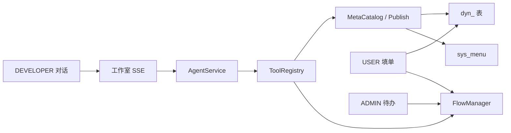

# Auto-Soft MVP 实现规格

> 文档日期：2026-08-20  
> 范围：阶段 2～5 已落地实现（元数据引擎、工作室、单线审批、安全收口）  
> 状态：**已实现 / MVP 冻结**  
> 接口清单见 [../api.md](../api.md)，使用说明见 [../user-guide.md](../user-guide.md)

本文描述**当前代码实际行为**，不是规划草案。阶段计划原文仍保留在 `docs/阶段*.md`。

---

## 1. 产品规格

### 1.1 目标

用户用自然语言描述后台需求；系统通过已注册工具改元数据，发布后立刻得到可点可用的动态 CRUD 页；若需求带审批，则挂单线流程。

### 1.2 硬约束

| 项 | 规格 |
| --- | --- |
| 代码生成 | **不**写入 Java / Vue 源码文件 |
| 动态表 | 仅 `dyn_{appCode}_{entityCode}`；DDL 只 CREATE / ADD COLUMN，无 DROP |
| 标识符 | `^[a-z][a-z0-9_]{1,30}$`；SQL 标识符白名单，值全部 bind |
| 大模型 | OpenCode Go；P0 仅 Chat Completions；yml 兜底 `kimi-k2.7-code` |
| JWT | nimbus-jose-jwt；权限不进 token，每次查库 |
| HTTP | 401/403 时 body 仍为 `R<T>`；公开注册关闭 |
| 审批 | 单线 1～3 级，按角色办理；不会签 / 或签 / 条件分支 |

### 1.3 角色

| code | 能力 |
| --- | --- |
| `SUPER_ADMIN` | 绕过权限码；用户/角色、模型设置、操作日志、建模、工作室 |
| `ADMIN` | 用户/角色、待办审批 |
| `DEVELOPER` | 应用建模、工作室、草稿预览 |
| `USER` | 已授权动态页的 CRUD / 提交；不可建模、不可改 LLM Key |

内置角色不可删除。授予 `SUPER_ADMIN` 仅超管可操作。

### 1.4 明确不做（冻结）

写 Java/Vue 热加载；复杂报表；多租户；自定义脚本；会签/条件分支；移动端；Refresh Token；schema / DDL 自动回滚；物理删列；用户自填 API Key。

---

## 2. 系统架构

```text
web/ (Vue3 + Ant Design Vue 4)
  └─ /api  ──Vite 代理──►  auto-soft-boot :8080
                              ├─ framework  Security / JWT / traceId / CORS
                              ├─ system     用户角色菜单 / 操作日志
                              ├─ meta       元数据 + 动态 CRUD + DDL
                              ├─ agent      OpenCode Go + 工具循环 + SSE
                              └─ flow       单线审批（封装自建表）
```

依赖方向：`boot → agent/flow → meta → system → framework → common`。Controller 零业务，只调 Service 返回 `R<T>`。

### 2.1 主链路



---

## 3. 元数据与动态运行时

### 3.1 应用生命周期

| 状态 | 含义 |
| --- | --- |
| `DRAFT` | 可改 schema；USER 不可见 |
| `PUBLISHED` | 已 ensure 表 + 菜单可见；`version + 1` |

- **发布**：先 DDL，失败保持 `DRAFT`。按 `grant_roles` 授权菜单。权限码 `app:{app}:{entity}:list|create|update|delete|submit`。
- **取消发布**：菜单 `visible=0`，表与数据保留。
- **回滚**：不支持 DDL 回滚；已加列不删除。

### 3.2 字段类型（白名单）

`string` / `text` / `int` / `long` / `decimal` / `bool` / `date` / `datetime` / `dict` / `ref`

系统列不可作业务字段：`id`、`created_by`、`created_at`、`updated_by`、`updated_at`、`deleted`、`flow_status`。

### 3.3 运行时行为

- 路由：`/app/:app/:entity`，组件 `SchemaRenderer`。
- `preview=true` 仅 `DEVELOPER` / 超管，用于未发布草稿。
- 列表：未知查询字段忽略；排序列必须在元数据白名单。
- 未绑流程：`flow_status = none`，无提交按钮。
- 已绑流程：新建为 `draft`；`processing` / `approved` 不可改删；`rejected` 可改后再提交。

### 3.4 前端入口

| 路径 | 页面 | 角色 |
| --- | --- | --- |
| `/meta/apps` | 手工建模 | DEVELOPER / 超管 |
| `/app/:app/:entity` | 动态 CRUD | 被授权角色 |
| `/dashboard` | 工作台含已发布应用卡片 | 全员 |

---

## 4. 功能开发工作室

### 4.1 布局与权限

左约 40% 对话，右约 60% 草稿预览。权限码 `studio:use`。一次会话只绑定一个 `appId`。

底栏：新开会话、发布（二次确认，走 `PublishService`）。顶栏展示本会话 `token_input` / `token_output`。

### 4.2 对话编排

`AgentService.runTurn`：

1. 加载会话与历史（最多 20 条，旧 tool 结果截断）
2. 调 OpenCode Go（默认配置中的模型）
3. 若 `tool_calls`：校验名称必须已注册 → 执行 → 写 `ai_tool_log` → 结果回灌（截断 8KB）
4. 循环上限 **8**；超限提示缩短需求或去建模页手工改
5. SSE 事件：`text` / `tool_start` / `tool_end` / `schema_updated` / `error` / `done`

Chat 走独立 `fetch` + `ReadableStream`，不经 axios 解包。Vite `/api` 代理超时关闭，避免 SSE 被掐断。

### 4.3 已注册工具

模型不能发明未注册工具。参数再走 Meta / Identifiers / FieldTypes，不信任模型 JSON。

| 工具 | 作用 |
| --- | --- |
| `ask_user` | 澄清，不写库 |
| `create_app` / `update_app` | 草稿应用 |
| `define_entity` | 建实体 |
| `add_field` / `update_field` | 字段 |
| `define_page` | LIST/FORM/DETAIL，schema 可空 |
| `bind_menu` | 记录 `grant_roles`，发布时授权 |
| `get_current_schema` | 读当前草稿 |
| `preview_app` | 通知前端刷新右栏，无 DDL |
| `publish_app` | 必须 `confirm=true` |
| `create_simple_flow` | 1～3 级角色单线审批并绑定 |
| `bind_flow` | 绑定已有定义 |

### 4.4 模型设置

路径 `/system/llm`，权限 `system:llm:manage`（仅超管）。

- Key：AES-256-GCM，密钥材料 `autosoft.crypto.aes-key`（SHA-256 派生 32 字节）；接口只回显 `********`
- `GET /api/system/llm-models` 缓存 1 小时
- 协议路由：Chat 为默认；`minimax`/`qwen3` → Anthropic 提示改选 Chat；`grok`/`gpt-5.6`/`luna` → Responses 提示未开放
- 429 文案：「额度或限流，请更换模型或稍后」；禁止日志打印 Key

---

## 5. 单线审批

### 5.1 流程形态

```text
开始 → 提交人(已办) → 审批节点(roleCode)[最多 3 级] → 结束
```

- 办理人按**角色**：该角色任意用户可办。
- **驳回**：终止当前实例，`flow_status=rejected`，意见必填；再次提交 **start 新实例**。
- 未绑定实体：无提交按钮。

实现类：`FlowManager`（`FlowHook` / `FlowSubmitHook` / `FlowBinder`）。官方 warm-flow PostgreSQL 脚本未纳入；业务表 `sys_flow_definition` / `sys_flow_instance` / `sys_flow_task` / `meta_entity_flow`。配置 `warm-flow.enabled=false`。

### 5.2 待办

| 路径 | 说明 |
| --- | --- |
| `/flow/todo` | 我的待办（角色命中） |
| `/flow/done` | 我已办 |

登录即可进待办页；`complete` / `reject` 时再校验任务角色。猜 `taskId` 且角色不符 → 403。

---

## 6. 安全与可观测

| 项 | 规格 | 结论 |
| --- | --- | --- |
| 运行时 SQL | 表名/列名/排序白名单，值 bind | 已有 |
| DDL | 仅 `dyn_` + code 正则，无 DROP | 已有 |
| 工具参数 | 与 MetaService 同一套校验 | 已有 |
| 越权 | USER 不能 preview 他人草稿、不能调 `/api/meta/**`、不能改 LLM Key | 已有 |
| 密钥 | LLM Key、JWT secret、AES key 不进日志与操作日志详情 | 已有 |
| CORS | 开发仅 `http://localhost:5173` | 已有 |
| 健康检查 | `/api/health` 匿名；actuator 细节 `when_authorized` | 已有 |
| traceId | Filter 写入 MDC、`R.traceId`、`X-Trace-Id` | 已有 |

操作日志表 `sys_oper_log`。`@OperLog` 覆盖：用户维护、角色授权、发布/取消发布、提交、通过、驳回。查询页 `/system/logs`，仅超管。`detail_json` 脱敏密码 / token / apiKey。

---

## 7. 数据与配置

Flyway：`V1.0.0`～`V1.5.0`，只新增不改已执行脚本。表结构见 [../database.md](../database.md)。

关键配置（`application.yml` / `application-dev.yml`）：

| 键 | 用途 |
| --- | --- |
| `autosoft.jwt.secret` | JWT 签名，生产必须替换 |
| `autosoft.crypto.aes-key` | AES 材料，生产必须替换 |
| `autosoft.opencode.base-url` | 默认 `https://opencode.ai/zen/go/v1` |
| `autosoft.auth.register-enabled` | 默认 `false` |
| `warm-flow.enabled` | 默认 `false` |
| `spring.mvc.async.request-timeout` | 300000（SSE） |

动态表公共列：`id`、`created_by`、`created_at`、`updated_by`、`updated_at`、`deleted`、`flow_status`。

---

## 8. 前端路由

| path | 组件 | 权限来源 |
| --- | --- | --- |
| `/login` | 太阳系登录 | 匿名 |
| `/dashboard` | 工作台 | 全员 |
| `/system/users` `/system/roles` | 用户 / 角色 | 菜单 |
| `/system/llm` | 模型设置 | `system:llm:manage` |
| `/system/logs` | 操作日志 | `system:log:list` |
| `/meta/apps` | 建模 | `meta:app:manage` |
| `/studio` | 工作室 | `studio:use` |
| `/app/:app/:entity` | 动态页 | 发布菜单 |
| `/flow/todo` `/flow/done` | 待办 / 已办 | 登录 |
| `/403` `/404` | 无权限 / 不存在 | — |
| `/dev/health` | 健康页 | 匿名 |

Token 键：`autosoft.token`。发布后 USER 需重新登录或刷新菜单才看到新 `/app/...`。

---

## 9. 验收口径

示例话术：「做请假单，字段请假天数（数字）、原因（多行文本），提交后要 ADMIN 审批。」

1. 超管配置 Key；`demo_dev` 工作室生成并发布，授权 USER。  
2. `demo_user` 看到菜单，填写并提交。  
3. `demo_admin` 待办通过；单据只读。驳回后可改再提交。  
4. USER 打不开建模、改不了 LLM Key。  
5. 超管操作日志能看到发布与审批，无密钥。  
6. 停库再启，Flyway 不报校验失败。

走查记录：[../e2e-mvp.md](../e2e-mvp.md)。开发账号密码均为 `admin123`（仅开发库）。

---

## 10. 实现对照（代码入口）

| 能力 | 后端入口 | 前端 |
| --- | --- | --- |
| 建模 | `MetaAppController` / `MetaCatalogService` / `PublishService` / `DdlManager` | `MetaAppView.vue` |
| 动态 CRUD | `RuntimeController` / `RuntimeService` / `RuntimeSqlManager` | `RuntimePageView.vue` + `SchemaRenderer.vue` |
| 工作室 | `StudioController` / `AgentService` / `ToolRegistry` | `StudioView.vue` |
| 模型 | `LlmConfigController` / `OpenCodeGoManager` | `LlmSettingView.vue` |
| 审批 | `FlowTodoController` / `FlowManager` | `TodoView.vue` / `DoneView.vue` |
| 操作日志 | `OperLogController` / `OperLogAspect` | `OperLogView.vue` |
| 链路追踪 | `TraceIdFilter` / `TraceIdResponseAdvice` | `R.traceId` |
