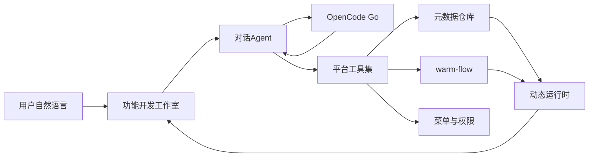

# AI 管理后台 MVP 分阶段开发计划

> 文档日期：2026-08-20  
> 适用范围：首期 MVP  
> 代码目录约定：前端 `web/`，后端 `dev/`，设计文档 `docs/`

## 1. 已确认决策

- **能力边界**：元数据驱动的动态 CRUD + warm-flow 审批流。用户对话后立刻得到可点可用的页面与流程，**MVP 不生成、不写入 Java/Vue 源码文件**。
- **大模型**：OpenCode Go。管理员在系统设置里从 Go 模型列表选择，代码只保留一个兜底默认（建议 `kimi-k2.7-code`，OpenAI 兼容、额度较充裕）。
- **规范**：阿里巴巴 Java 开发手册；Controller 禁止业务代码；复杂业务主方法只写步骤，逐步下沉。

## 2. 产品定位（MVP）

传统后台「提需求 → 改代码 → 测试 → 上线」周期长。本系统把「能被复用的能力」预先做进平台，用户只描述需求；Agent 调用这些能力组装出功能。

**所见即所得**：功能开发模块左侧对话、右侧实时预览；发布后菜单立刻出现，数据立刻可增删改查。若需求带审批，Agent 同时生成 warm-flow 流程并挂到该实体的提交动作上。



## 3. 技术选型

| 层 | 选型 |
| --- | --- |
| JDK | 25（`maven.compiler.release` 与 enforcer `[25,)`） |
| 后端 | Spring Boot **4.1.x** + Spring Security + JWT |
| ORM | MyBatis-Plus（与 warm-flow sb4 starter 对齐） |
| 工作流 | `warm-flow-mybatis-plus-sb4-starter`（当前 1.8.9） |
| 库 | PostgreSQL 16+，迁移用 Flyway |
| 前端 | Vue 3 + Vite + TypeScript + Ant Design Vue 4 + Pinia + Vue Router |
| 登录动效 | Three.js 太阳系（真实轨道/自转/星空，非纯 CSS 装饰） |
| LLM | OpenCode Go，按模型路由三种协议 |

后端额外能力：SSE 流式对话、AES 加密存储 API Key、动态 DDL（仅允许 `dyn_` 前缀表）。

## 4. 仓库结构

```
auto-soft/
  docs/                          # 设计与规范
  web/                           # Vue3 前端
  dev/                           # Spring Boot 多模块
    pom.xml
    auto-soft-common/            # 统一返回、异常、分页、工具
    auto-soft-framework/         # Security、JWT、Web 配置
    auto-soft-system/            # 用户、角色、菜单、字典、系统设置
    auto-soft-meta/              # 元数据、动态 DDL、动态 CRUD 运行时
    auto-soft-agent/             # 对话、工具调用、OpenCode Go 接入
    auto-soft-flow/              # warm-flow 封装与业务绑定
    auto-soft-boot/              # 启动模块
```

分层（阿里手册）：

- **Controller**：鉴权上下文、参数校验（`@Validated`）、调 Service、返回 `R<T>`。零业务。
- **Service**：业务编排。主方法只写步骤（1.校验 2.落库 3.刷新缓存），每步一个私有/协作方法。单方法超过约 80～150 行必须拆。
- **Manager**：第三方封装——OpenCode Go、warm-flow、动态 DDL。
- **Mapper**：只做数据访问。
- 对象：DO / DTO / Query / VO，Controller 不直接暴露 DO。

命名：类名 UpperCamelCase；方法/变量 lowerCamelCase；常量全大写下划线；包名全小写；禁止魔法值。

## 5. 核心架构：元数据 + 运行时，而不是代码生成

MVP **禁止**把 LLM 输出的 Java/Vue 文件写进仓库再热加载。那样不可控、难回滚、安全风险高。

预先引入的能力（Agent 只能调用这些工具，不能任意执行 SQL）：

1. **数据模型**：建实体、加字段、改字段、软删字段（物理表 `dyn_{appCode}_{entityCode}`）
2. **页面模型**：列表/表单/详情 schema（组件、校验、查询项、列宽）
3. **菜单权限**：生成菜单、按钮权限码、角色授权
4. **工作流**：生成 warm-flow 定义（开始 → 提交人 → 审批人 → 结束），绑定「提交」动作
5. **发布**：草稿 → 预览 → 发布；发布后菜单可见

动态表字段白名单类型：`string / text / int / long / decimal / bool / date / datetime / dict / ref`。系统自动加 `id, created_by, created_at, updated_by, updated_at, deleted, flow_status`。

运行时通用接口（示意）：

- `GET /api/runtime/{app}/{entity}/page`
- `GET /api/runtime/{app}/{entity}/{id}`
- `POST /api/runtime/{app}/{entity}`
- `PUT /api/runtime/{app}/{entity}/{id}`
- `DELETE /api/runtime/{app}/{entity}/{id}`
- `POST /api/runtime/{app}/{entity}/{id}/submit`（启动流程）
- `POST /api/flow/todo/{taskId}/complete|reject`

列名、排序字段全部来自元数据白名单，禁止拼接用户输入为 SQL 标识符。

## 6. OpenCode Go 接入

官方端点（同一 API Key，`Authorization: Bearer`）：

- OpenAI Chat：`https://opencode.ai/zen/go/v1/chat/completions`  
  如 `glm-5.x`、`kimi-k*`、`deepseek-v4-*`、`mimo-v2.5*`、`hy3`
- Anthropic Messages：`https://opencode.ai/zen/go/v1/messages`  
  如 `minimax-m*`、`qwen3.*`
- OpenAI Responses：`https://opencode.ai/zen/go/v1/responses`  
  如 `grok-4.5`、`gpt-5.6-luna`、`muse-spark-1.2-contributor`

模型列表：`GET https://opencode.ai/zen/go/v1/models`

设计要点：

- `OpenCodeGoManager`（位于 `dev/auto-soft-agent`）按 `modelId` 选协议，对上层只暴露「对话 + tool calling + SSE」。
- 管理员配置：API Key（加密）、允许模型、当前默认模型。未配置时用 `application.yml` 兜底。
- Go 限额按美元滚动（约 $12/5h、$30/周、$60/月）。系统记录 token/请求，429 时返回明确提示。
- 首期 tool calling 以 **OpenAI 兼容模型** 为主路径；选 Qwen/MiniMax 时走 Anthropic tool use；Responses 协议第二优先。
- 不把用户业务数据以外的系统密钥送给模型；工具结果做长度截断。

额度建议：管理员默认选 `kimi-k2.7-code` 或 `deepseek-v4-flash`；避免默认 `kimi-k3`（约 110 次/5h，工作室很容易打满）。

## 7. 功能开发工作室（WYSIWYG）

布局：左对话（Markdown + 工具进度），右预览（动态渲染器：Ant Design Vue 表格/表单）。底部：澄清问题、发布、回滚草稿。

对话主流程（Service 步骤化）：

1. 加载会话与当前草稿 app
2. 组装系统提示词（只允许调用已注册工具）
3. 流式请求 Go
4. 若有 tool_call：校验参数 → 执行工具 → 回写 → 再请求模型
5. 工具成功则刷新右侧预览 schema
6. 持久化消息与 token 用量

Agent 工具清单（MVP）：

- `ask_user`：澄清（实体名、字段、是否审批、审批角色）
- `create_app` / `update_app`
- `define_entity` / `add_field` / `update_field`
- `define_page`（list/form）
- `bind_menu`
- `create_simple_flow`（提交人 + N 级审批角色）
- `bind_flow`
- `preview_app` / `publish_app`
- `get_current_schema`

系统提示词约束：一次只改一个 app；先澄清再动手；字段必须有中文名与类型；审批人必须是已有角色。

## 8. 登录页

独立全屏路由，无后台 layout。Three.js：太阳、行星轨道公转、自转、星空、轻微相机漂移。右侧玻璃拟态登录卡（账号/密码、记住登录、错误抖动）。性能：`prefers-reduced-motion` 降级为静态星空；WebGL 失败走 CSS 后备。

## 9. 权限模型（MVP）

内置角色：

- `SUPER_ADMIN`：系统设置 / 模型配置
- `ADMIN`：用户、角色、菜单
- `DEVELOPER`：功能开发工作室
- `USER`：使用已发布功能

JWT + RBAC。动态菜单来自「系统菜单 ∪ 已发布 app 菜单」。动态接口按 `app:entity:action` 鉴权。

## 10. 数据库（系统表，Flyway）

用户权限：`sys_user`、`sys_role`、`sys_user_role`、`sys_menu`、`sys_role_menu`。

LLM：`sys_llm_config`、`ai_session`、`ai_message`、`ai_tool_log`。

元数据：`meta_app`、`meta_entity`、`meta_field`、`meta_page`、`meta_app_menu`。

工作流：warm-flow 官方 PostgreSQL 脚本 + `meta_entity_flow`（实体与流程定义绑定）。

## 11. 分阶段计划

建议实施顺序：**阶段 0 → 1 → 2 → 3 → 4 → 5**。

阶段 2 是整条链路的底座，必须在 Agent 之前可手工跑通 CRUD；阶段 4 的流程工具建立在已发布实体之上。

总工期参考：约 **26～37 人天**。

### 阶段 0：脚手架与规范（约 1～2 天）

完整任务拆解、目录树、验收清单见：[阶段0-脚手架与规范.md](./阶段0-脚手架与规范.md)

产出：

- `docs/00-overview.md`、`docs/coding-standards.md`、`docs/database.md`、`docs/dev-setup.md`
- `dev` Maven 多模块可启动，健康检查 `/api/health` 与 `/actuator/health`
- `web` Vite + Vue3 + Ant Design Vue + 路由骨架
- Flyway 基线脚本 `V1.0.0__init.sql`；`.gitignore`、示例 `application-dev.yml`

验收：两端空跑成功，文档说明如何启动。

### 阶段 1：登录、用户、角色（约 4～6 天）

完整任务拆解、表结构、API 与验收清单见：[阶段1-登录用户角色.md](./阶段1-登录用户角色.md)

后端：注册（可先关、仅管理员开户）、登录、改密、用户 CRUD、角色 CRUD、授权菜单。密码 BCrypt。Controller 只调 `AuthService` / `UserService` / `RoleService`。

前端：太阳系登录页；后台 layout（侧栏 + 顶栏 + 多标签可选）；用户/角色页。

验收：三种角色登录后菜单不同；错误密码有提示；登录页有立体动效且可降级。

### 阶段 2：元数据引擎 + 动态页面运行时（约 6～8 天）

完整任务拆解、表结构、运行时 API 与验收清单见：[阶段2-元数据引擎与动态运行时.md](./阶段2-元数据引擎与动态运行时.md)

这是「提前引入的能力」。先做**手工配置一条演示实体**（如「物品登记」），证明不写业务代码也能出 CRUD 页。

后端：`MetaService` 维护 schema；`DdlManager` 建/改 `dyn_` 表；`RuntimeService` 通用 CRUD（分页、条件、排序白名单）。

前端：`SchemaRenderer` 根据 JSON 渲染 `a-table` / `a-form`；动态路由 `/app/:app/:entity`。

验收：改 schema 后刷新即变，无需发版。

### 阶段 3：功能开发模块 + OpenCode Go（约 7～10 天）

完整任务拆解、协议路由、工具清单与验收清单见：[阶段3-功能开发与OpenCode.md](./阶段3-功能开发与OpenCode.md)

系统设置：Go API Key、拉取模型列表、指定默认模型。

工作室：SSE 对话、工具循环、右侧预览、草稿保存。Agent 能独立完成「建实体 + 字段 + 列表表单 + 挂菜单」。

验收示例：「做一个客户档案，字段有名称、电话、备注，我能增删改查」。发布后侧栏出现菜单，USER 可操作。

### 阶段 4：warm-flow 审批（约 5～7 天）

完整任务拆解、流程模板、待办 API 与验收清单见：[阶段4-warm-flow审批.md](./阶段4-warm-flow审批.md)

集成官方 PostgreSQL 脚本与 sb4 starter。封装 `FlowManager`（启动、待办、通过、驳回、记录）。

Agent 工具 `create_simple_flow` / `bind_flow`。动态页在 `flow_status=draft` 时可提交；审批中只读；通过后生效。待办中心：我的待办 / 已办。

MVP 流程形态：单线审批（提交人 → 指定角色 → 结束），不做会签/或签/条件分支。

验收：「请假单：天数、原因，提交后由 ADMIN 审批」。USER 提交，ADMIN 待办通过/驳回，列表状态正确。

### 阶段 5：收口与 MVP 冻结（约 3～4 天）

完整安全复查、操作日志、端到端脚本与文档清单见：[阶段5-收口与MVP冻结.md](./阶段5-收口与MVP冻结.md)

- 动态接口鉴权、SQL 标识符白名单、工具参数校验
- 发布/回滚、会话列表、用量展示、429 友好提示
- 操作日志（用户维护、发布、流程关键动作）
- `docs/api.md`、`docs/user-guide.md`
- 端到端走查：登录 → 对话生成带审批的功能 → 发布 → 使用 → 审批

**明确不做（首期）**：写 Java/Vue 文件并热加载；复杂报表/图表；多租户；自定义脚本；会签或条件分支；移动端。

阶段 6 对「条件分支」做**受控解冻**：仅工作流图中的表达式 DSL（禁止任意脚本）。会签、自定义脚本节点仍不做。详见 [阶段6-自动化工作流.md](./阶段6-自动化工作流.md)。

### 阶段 6：自然语言生成自动化工作流（A 约 10～14 天）

完整 IR、节点白名单、模块表、Agent 工具、运行时与验收见：[阶段6-自动化工作流.md](./阶段6-自动化工作流.md)

用户描述目标与步骤，Agent 生成可执行 DAG（类比 Dify，但拖拽只用于修正）。新模块 `auto-soft-workflow`，不扩展 `FlowManager`。工作室 `app_kind=workflow`，右侧画布与同一套 SSE。A：手动触发 + `meta.query` / `llm` / `notify`；B：条件、审批节点、表单触发、分享；C：白名单 HTTP 与定时。

验收（A）：「根据合同 ID 查记录，用 LLM 起草提醒，发给 ADMIN」→ 画布可改 → 试跑 → 发布 → 菜单运行。

## 12. 关键风险

- **模型协议分裂**：用 `ModelProtocolRouter` 隔离，先保证 Chat Completions + tools，再补另外两条。
- **Go 额度**：设置页展示当前模型与限额说明；默认避开高单价模型。
- **动态 DDL**：事务 + 只允许 `dyn_` + 类型白名单；删除字段软删，物理 DROP 仅 SUPER_ADMIN 且二次确认（MVP 可先不做物理删）。
- **LLM 不稳定**：工具 JSON schema 约束；失败可重试；支持用户手动改字段（阶段 5 可做简易 schema 编辑，降低全靠模型的风险）。
- **warm-flow 与 Boot 4**：已有 `*-sb4-starter`，版本锁定 1.8.9，集成日先跑官方请假示例再接动态实体。

## 13. 阶段任务清单

| 阶段 | 任务 | 状态 |
| --- | --- | --- |
| 0 | 建 `docs/` `web/` `dev/` 骨架、规范文档、Spring Boot 4.1 多模块与 Vue3 空工程、Flyway | 已完成 |
| 1 | JWT 登录、用户/角色/菜单 RBAC，太阳系登录页 + 后台 layout | 已完成 |
| 2 | 元数据引擎、`dyn_` 动态表、通用 CRUD API、SchemaRenderer 与动态路由 | 已完成 |
| 3 | OpenCode Go 多协议路由、管理员指定模型、工作室 SSE + tool calling 生成 CRUD | 已完成 |
| 4 | warm-flow 集成、待办中心、Agent 生成单线审批并绑定实体 | 已完成 |
| 5 | 鉴权/白名单/发布回滚/用量与日志、端到端验收与文档 | 已完成 |
| 6 | 自然语言生成 DAG 工作流（可编辑、发布、分享），与单线审批分离 | 文档已就绪 |
