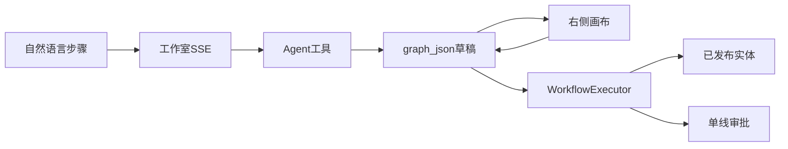

# 阶段 6：自然语言生成自动化工作流（完整开发计划）

> 文档日期：2026-08-28  
> 对应总计划：[分阶段开发计划.md](./分阶段开发计划.md)  
> 前置：[阶段5-收口与MVP冻结.md](./阶段5-收口与MVP冻结.md)（MVP 已冻结；本阶段为冻结后的新能力）  
> 工期：A 约 10～14 人天；B 约 5～7 人天；C 约 5～7 人天（同一文档分期，不拆 6.1/6.2 文件）  
> 目标：用户用自然语言描述目标与步骤，系统生成可执行 DAG；画布可改、可试跑、可发布、可分享。产品类比 Dify，但**不以拖拽为建模起点**。不引入 Dify / n8n 依赖。

---

## 1. 阶段目标

1. 新增一等能力 **自动化工作流**，与现有单线审批（`auto-soft-flow` / `FlowManager`）**分离**：审批仍是人审；DAG 是引擎按图跑。
2. 工作室增加 `app_kind=workflow`。路由仍为 `/studio`；右侧按 kind 切流程图画布。可选菜单「工作流」指向同一工作室并带 query（如 `?kind=workflow`）。**不新开第二套对话引擎**。
3. Agent 只通过已注册工具改 **Workflow IR（`graph_json`）**。禁止模型直出未校验 JSON、禁止写 Java / Vue 源码、禁止任意 SQL。
4. 生成路径：自然语言为主，画布为修正。草稿 → 校验 → 试跑 → 二次确认发布 → 菜单可运行。
5. Controller 零业务；编排在 Service 步骤化；节点执行在 `WorkflowExecutor` 按 type 注册。
6. 验收话术（A）：「根据合同 ID 查记录，用 LLM 起草提醒，发给 ADMIN」对话生成 → 画布改标题 → 试跑 → 发布 → 菜单运行。

## 2. 本阶段明确不做

| 内容 | 说明 |
| --- | --- |
| 扩展 `FlowManager` 成 DAG | 人审继续单线 1～3 级；图中 `approval` 节点（6B）只**调用**现有人审 |
| 任意代码节点（Python / JS / Java 热加载） | 与 MVP「禁止自定义脚本」一致 |
| 知识库 / RAG、插件市场、多模态 | 另一条产品线 |
| 会签 / 或签 / 票签 | 审批引擎仍不做 |
| 无限循环、浏览器 RPA、任意文件读写 | 安全与范围 |
| 内网 / 元数据 SSRF 的 `http` | 6C 仅配置的 egress 域名白名单 |
| 分享时带出 LLM Key、HTTP Header 密钥 | 密钥用 `secret_id` 引用；分享剥离 |

### 相对 MVP 冻结的解冻（写死边界）

阶段 5 曾写明「会签或条件分支」首期不做。阶段 6 **受控解冻条件**：仅 `condition` 节点 + 表达式 DSL（比较、字段路径、少量函数），**禁止 `eval` / 任意脚本**。HTTP 与定时标为 **6C**，不进 A 验收。

## 3. 前置条件

- 工作室 SSE、工具循环、讨论 / 计划 / 开发模式已可用（[阶段3-功能开发与OpenCode.md](./阶段3-功能开发与OpenCode.md)）。
- 元数据发布、`dyn_` 白名单 CRUD 已可用（阶段 2）。
- 单线审批与待办已可用（阶段 4）；6B 的 `approval` 依赖此。
- 超管已配置 OpenCode Go；工作流 LLM 节点只用**系统级**模型配置，禁止用户自填 Key。
- 当前 Flyway 已到 `V1.7.0`；本阶段新脚本 **`V1.8.0__workflow.sql`**。落地编码时再补 [database.md](./database.md)。不改 [spec/mvp.spec.md](./spec/mvp.spec.md)（2～5 As-Built）。

## 4. 与现有能力对照

| | 功能开发（已有） | 自动化工作流（本阶段） |
| --- | --- | --- |
| `app_kind` | `admin` / `frontend` / `h5` | `workflow` |
| 产物 | 动态表 + 列表表单 + 菜单 | 节点图 IR |
| 执行者 | 人填单、人审批 | 引擎按图跑 |
| 流程形态 | 单线审批 1～3 级 | DAG；A 先串行 |
| 右侧预览 | Schema / PageRenderer | 流程图画布 |
| 编辑 | 建模页 / 对话改元数据 | 对话改图 + 画布改同一份 `graph_json` |

意图分类：会话绑定一个 `appId`。`workflow` 会话禁止 `define_entity`；CRUD 会话禁止工作流节点工具。Prompt 先确认需求类型。



## 5. 已确认产品决策

- **与审批分离**：新模块 `auto-soft-workflow`。依赖向下：`boot → agent/workflow → meta → system → …`。`auto-soft-agent` 只加工具，不执行节点。
- **入口**：`/studio` + `app_kind=workflow`；菜单「工作流」可选，同一套 Agent。
- **IR 一等公民**：画布是 IR 的投影；对话改图、人手改图都写同一草稿。运行只跑**已发布 version 快照**。
- **A / B / C 写在本文**，实施按列验收，不平行铺开 C。

## 6. Workflow IR

模型不得一次吐整张未校验图。工具参数经 `WorkflowGraphValidator`，与 Meta 标识符同一套不信任模型的原则。

### 6.1 示例（阶段 A 形态）

```json
{
  "version": 1,
  "name": "合同到期提醒",
  "trigger": { "type": "manual", "input_schema": { "contractId": "long" } },
  "nodes": [
    { "id": "n1", "type": "start", "title": "开始" },
    { "id": "n2", "type": "meta.query", "title": "查合同", "config": { "app": "hr", "entity": "contract", "id": "{{input.contractId}}" } },
    { "id": "n4", "type": "llm", "title": "起草提醒", "config": { "prompt": "根据合同写一封到期提醒", "input": "{{n2}}" } },
    { "id": "n5", "type": "notify", "title": "发站内信", "config": { "toRole": "ADMIN", "body": "{{n4.text}}" } },
    { "id": "n6", "type": "end", "title": "结束" }
  ],
  "edges": [
    { "from": "n1", "to": "n2" },
    { "from": "n2", "to": "n4" },
    { "from": "n4", "to": "n5" },
    { "from": "n5", "to": "n6" }
  ]
}
```

6B 可在 `n2` 与 `n4` 之间插入 `condition`（`when`: `true` / `false` 边）。禁止未注册 `type`。

### 6.2 校验规则（保存 / 发布 / 试跑前必跑）

1. `version` 为已知 IR 版本；`nodes[].id` 唯一，编码 `^[a-z][a-z0-9_]{1,30}$`。
2. `type` 必须在当前分期白名单内。
3. 恰好一个 `start`、至少一个 `end`；`start` 无入边，`end` 无出边。
4. 无环（A 串行；B 条件仍无环；C 若引入循环须单独设计并限额，默认不做）。
5. 除 `start` 外每个节点可达；除 `end` 外每个节点有出边（`condition` 必须同时有 true/false 出边）。
6. `meta.*` 的 `app` / `entity` / 字段必须是**已发布**元数据白名单；禁止编造。
7. 模板 `{{input.x}}` / `{{nodeId.field}}` 只能引用上游已存在路径。
8. `llm` 不出现用户 API Key；`http`（6C）URL 主机必须在 egress 白名单。

## 7. 节点白名单

| 类型 | 分期 | 作用 | 安全边界 |
| --- | --- | --- | --- |
| `start` / `end` | A | 出入 | — |
| `trigger.manual` | A | 页面按钮 / `POST /api/wf/{code}/run` | 登录与权限码 |
| `meta.query` | A | 按主键或白名单条件读已发布实体 | 表名列名白名单，禁止任意 SQL |
| `llm` | A | 调用平台已配置模型 | 系统 Key；token 计入运行日志 |
| `notify` | A | 站内信 / 待办类通知 | 先角色 `toRole`，不接任意邮件网关 |
| `condition` | B | 布尔二分 | 表达式 DSL：比较、`empty`、`daysUntil` 等；禁止脚本 |
| `approval` | B | 插入现有单线审批 | 调用 `FlowManager`，不新造 BPM |
| `trigger.form` | B | 已发布实体提交后触发 | 复用 `dyn_` 与 `flow_status` |
| `meta.upsert` | B | 白名单字段写入 | 与 Runtime 同一套校验 |
| `http` | C | 出站请求 | 域名白名单、禁内网、超时与体积限制 |
| 定时触发 | C | cron / 固定间隔 | 超管配置；租户内频率上限 |

A 禁止条件、HTTP、定时、审批节点。未注册类型直接拒。

## 8. 目录增量

```
dev/auto-soft-workflow/          # 新模块
  graph/                         # IR 模型、Validator
  exec/                          # WorkflowExecutor、NodeExecutor 按 type
  def/                           # 定义草稿、版本、发布
  run/                           # 运行实例、步骤日志
  share/                         # 分享码
  web/WorkflowController.java    # 仅调 Service，返回 R<T>
dev/auto-soft-agent/.../tool/impl/
  CreateWorkflowTool 等
dev/auto-soft-boot/.../db/migration/V1.8.0__workflow.sql
web/src/views/studio/            # 按 app_kind 切右侧
web/src/components/workflow/     # 画布（建议 Vue Flow，实施时锁版本）
web/src/views/workflow/          # 已发布运行页（可选独立路由）
```

`dev/pom.xml`、`auto-soft-boot` 增加模块依赖。`MapperScan` 增加 `com.autosoft.workflow.mapper`。

包根：`com.autosoft.workflow`。编码规范见 [coding-standards.md](./coding-standards.md)。

## 9. 数据库（规划，编码时再写入 database.md）

公共字段同阶段 1。表前缀 `wf_`。

### wf_definition

| 字段 | 说明 |
| --- | --- |
| code | 标识符白名单，未删除唯一 |
| name | 显示名 |
| status | `DRAFT` / `PUBLISHED` |
| graph_json | 当前草稿 IR |
| version | 已发布版本号，发布 +1 |
| visibility | 如 `private` / `org` |
| grant_roles | 发布时授权，类比 meta 应用 |

### wf_definition_version

每次发布快照：`definition_id`、`version`、`graph_json`。运行绑定 version。图可回滚到历史 version；**不**回滚 `dyn_` DDL。

### wf_run

实例：`definition_id`、`version`、`status`（`running` / `succeeded` / `failed` / `paused`）、`trigger_json`、当前节点、发起人。

### wf_run_step

每节点：输入/输出**摘要**、耗时、错误信息。脱敏：禁止密码、token、apiKey。

### wf_share

`token`、权限（只读预览 / 复制为草稿）、过期时间。复制草稿时剥离 secret 引用。

## 10. Agent 工具

模型不能发明未注册名称。计划模式只出步骤清单；开发模式才写图。工具循环上限建议 12～16（图比 CRUD 步数多），tool 结果仍截断。

| 工具 | 作用 |
| --- | --- |
| `create_workflow` | 建草稿，`app_kind=workflow`，一次会话一个定义 |
| `set_trigger` | A：`manual` + `input_schema` |
| `add_node` / `update_node` / `remove_node` | 改节点 |
| `connect_nodes` | 连边；B 起可带 `when` |
| `get_workflow_graph` | 读当前 IR |
| `validate_workflow` | 环、未连接、缺配置 |
| `dry_run_workflow` | 沙箱试跑，写 `wf_run`（标记 dry_run） |
| `publish_workflow` | 必须界面确认 `confirm=true` |
| `share_workflow` | 生成分享码（可 A 末或 B） |

Prompt 补充：先确认触发、输入、失败策略再落节点；禁止编造未发布 `app/entity`；`notify` / `approval` 角色必须已存在。改完调用 `validate_workflow` 并通知前端刷新画布（可复用 `schema_updated` 或新增 `graph_updated` SSE）。

## 11. 运行时

`WorkflowExecutor` 主方法只写步骤：

1. 加载已发布 `graph_json` 快照（试跑可用草稿 + 强制 dry_run 限额）
2. 校验 IR
3. 按拓扑执行；上下文做 `{{...}}` 替换
4. 按 `type` 查找 `NodeExecutor`
5. 写 `wf_run_step`
6. 失败：**停并记日志**（A/B 不做自动错误边；C 可选错误边）

约束：

- 同步试跑超时（建议 30s）、单次运行节点数上限
- LLM token 记入 `wf_run` / 会话用量
- A 可用 `@Async` 或同步；C 再上队列（Redis 非 A 前置）
- 人工节点（6B `approval`）：实例 `paused`，待办继续后唤醒

发布后入口：菜单「运行」、`POST /api/wf/{code}/run`。6B：`trigger.form` 挂在实体提交成功之后。

## 12. 前端

- 工作室：`app_kind=workflow` 时右侧为画布 + 选中节点属性表，不再用 CRUD SchemaRenderer。
- 画布只投影 IR；保存走 `PUT` 定义接口并服务端校验，**前端不执行** HTTP/LLM。
- 试跑面板：输入 `input_schema`、步骤日志、失败节点高亮。
- 发布二次确认，走与应用类似的确认框，调用 `publish_workflow` / `POST /api/wf/{id}/publish`。
- 已发布：工作台卡片或 `/wf/:code` 运行表单。
- 依赖建议 **Vue Flow**（或 AntV X6），实施时锁定版本写入 `web/package.json`。

权限：`studio:use` 可建模；运行权限码建议 `wf:{code}:run`；分享链接登录用户只读或复制草稿。

## 13. API 草案

前缀 `/api/wf`。鉴权与 `R<T>` 同现网。猜 id 无权限 → 403。

| 方法 | 路径 | 说明 |
| --- | --- | --- |
| POST | `/api/wf` | 建草稿 |
| GET | `/api/wf/{id}` | 定义 + graph |
| PUT | `/api/wf/{id}/graph` | 保存 IR（画布 / 非 Agent） |
| POST | `/api/wf/{id}/validate` | 只校验 |
| POST | `/api/wf/{id}/dry-run` | 试跑 |
| POST | `/api/wf/{id}/publish` | `{ confirm: true }` |
| POST | `/api/wf/{code}/run` | 按已发布 version 运行 |
| GET | `/api/wf/runs/{runId}` | 实例与步骤 |
| POST | `/api/wf/{id}/share` | 分享 |
| GET | `/api/wf/share/{token}` | 只读图（剥离密钥） |

Agent 路径仍走现有 `/api/studio/...` SSE，工具内部调 Workflow Service。

操作日志模块码：`WORKFLOW`；动作：`CREATE` / `UPDATE` / `PUBLISH` / `RUN` / `SHARE`。`detail_json` 脱敏。

## 14. 安全

| 项 | 要求 |
| --- | --- |
| 工具参数 | 与 Validator / Meta 同一套校验，不信任模型 |
| SQL | 仅已发布实体白名单；值 bind |
| 表达式 | DSL 白名单函数；禁止任意代码 |
| HTTP（6C） | egress 白名单；禁链路本地 / 私网 |
| 密钥 | 不进日志、不进分享 graph、不进操作日志详情 |
| 越权 | USER 不能改他人草稿；不能 dry-run 未授权定义 |
| 用量 | 试跑与正式跑都计节点数与 LLM token |

## 15. 任务拆解

| 任务 | 分期 | 内容 | 工期 |
| --- | --- | --- | --- |
| A1 | A | 模块骨架、`V1.8.0`、定义草稿 CRUD | 1.5d |
| A2 | A | IR 模型 + Validator | 1.5d |
| A3 | A | Executor：start/end/manual/meta.query/llm/notify | 3d |
| A4 | A | Agent 工具 + Prompt / SSE `graph_updated` | 2d |
| A5 | A | 工作室画布 + 试跑面板 | 3d |
| A6 | A | 发布、菜单运行、验收话术 | 1.5d |
| B1 | B | condition DSL + 二分边 | 2d |
| B2 | B | approval + trigger.form + meta.upsert | 2.5d |
| B3 | B | 分享复制草稿、密钥剥离 | 1.5d |
| C1 | C | http 白名单、定时、失败策略增强 | 5～7d |

A 合计 **约 10～14 人天**。B/C 按上表单列，A 未验收不得开工 C。

## 16. 验收清单

### 16.1 阶段 A（必须）

- [ ] `app_kind=workflow` 会话不会去 `define_entity`
- [ ] 话术「根据合同 ID 查记录，用 LLM 起草提醒，发给 ADMIN」能生成合法 IR（可用演示已发布合同实体；无实体时允许 `ask_user` 先指向已有应用）
- [ ] 画布改节点标题后与 `graph_json` 一致，刷新不丢
- [ ] `validate` 能拒绝环、未知 type、伪造实体
- [ ] dry-run 写出 `wf_run_step`；LLM Key 不出现在步骤日志
- [ ] 发布需 `confirm=true`；未确认工具调用失败
- [ ] 已发布后菜单或 `/wf/:code` 可手工触发；跑的是 version 快照，再改草稿不影响线上
- [ ] Controller 无 Executor 细节；无任意脚本入口

### 16.2 阶段 B / C（分期验收）

- [ ] B：`condition` 两分支都能走到 `end`；非法表达式拒收
- [ ] B：`approval` 待办与现有 `/flow/todo` 一致，通过后工作流继续
- [ ] B：分享只读；复制为草稿后无 secret 明文
- [ ] C：非白名单主机的 `http` 节点无法发布
- [ ] C：定时触发可关停，频率有上限

## 17. 风险

| 风险 | 处理 |
| --- | --- |
| 做成「第二个审批流」 | 文档与模块隔离；禁止改 `FlowManager` 形态 |
| 模型一步吐烂图 | 只允许工具增量改图 + Validator；计划模式先确认步骤 |
| 范围膨胀成 Dify | A 节点表锁死；知识库 / 代码节点列入不做 |
| LLM 费用与超时 | 试跑 30s、节点上限、token 展示；429 沿用现有文案 |
| 画布与 IR 双源 | 以后端 IR 为准，前端不本地执行 |

## 18. 交给后续编码 / 文档的接口

- 实现时更新 [database.md](./database.md)、[api.md](./api.md)、[user-guide.md](./user-guide.md)、[dev-setup.md](./dev-setup.md)（模块启动与菜单）。
- 阶段 6 全部落地并冻结后，另写 `docs/spec` 的 As-Built，**不要**改写 [spec/mvp.spec.md](./spec/mvp.spec.md)。
- 6B 对接 `FlowSubmitHook` / 提交后触发时，保持阶段 4 驳回「终止实例、再提新实例」语义不变。
