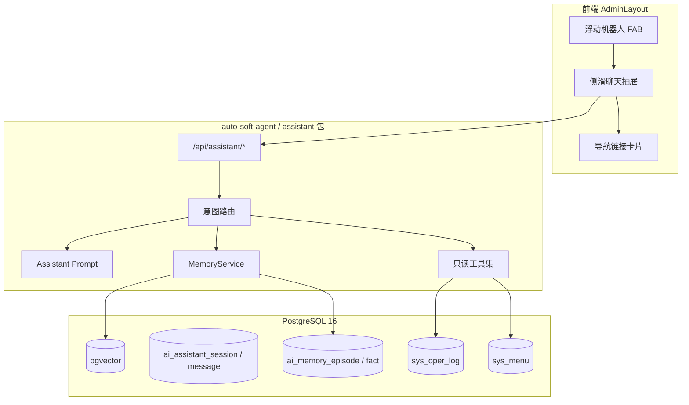

# 阶段 7：全局 AI 助手与记忆系统（完整开发计划）

> 文档日期：2026-08-28  
> 对应总计划：[分阶段开发计划.md](./分阶段开发计划.md)  
> 前置：[阶段6-自动化工作流.md](./阶段6-自动化工作流.md)（工作室 SSE、工具循环、RBAC 菜单、`sys_oper_log` 已可用）  
> 工期：P0 约 4～5 人天；P1 约 3～4 人天；P2 约 5～7 人天；P3 约 3～4 人天；P4 约 2～3 人天（可选）  
> 目标：全站右下角浮动 AI 机器人，可收起/展开；支持系统导航问答、个人操作历史问答、跨会话用户画像记忆、通用闲聊。记忆存储采用 **PostgreSQL + pgvector**，配合业务层 Consolidation 实现「近详远略」。

---

## 1. 阶段目标

1. 在后台任意页面提供 **全局浮动 AI 助手**（FAB + 侧滑抽屉），与 `/studio` 功能开发工作室 **分离**：不同 prompt、不同工具集、不同会话表/类型。
2. **导航问答**：用户问「用户管理在哪里」，助手返回**可点击链接**，跳转前校验当前用户菜单权限，禁止返回无权路径。
3. **操作历史问答**：用户问「我昨天有没有新增过用户」，助手基于 `sys_oper_log` **事实查询**回答；有则给出时间与前后操作时间线，无则友好说明。
4. **跨会话记忆**：记住用户姓名、职责、偏好等关键信息；近期对话保留较完整摘要，远期自动压缩为 fact + 短摘要。
5. **通用闲聊**：非系统问题可正常对话，但注入适量用户画像摘要，不强行调用系统工具。
6. Controller 零业务；对话编排在 Service；记忆 Consolidation 独立任务；向量检索封装在 Memory 层。

## 2. 本阶段明确不做

| 内容 | 说明 |
| --- | --- |
| 与 Studio 共用开发工具 | Assistant 禁止 `create_app`、`define_entity`、`publish_workflow` 等写库工具 |
| 替代 Studio 页面 | `/studio` 仍是元数据/工作流开发入口；助手只做「问与导」 |
| 知识库 / RAG 文档上传 | 另一条产品线；本阶段仅用户画像 + 对话/操作摘要 |
| 管理员查他人操作日志（经助手） | 普通用户只能查 `user_id = 自己`；超管审计仍走 `/system/logs` 页面 |
| 任意 SQL / 自然语言直查库 | 操作历史必须走封装好的 `OperLogQueryService`，禁止 LLM 拼 SQL |
| 页面浏览全量埋点（P4 前） | P0～P3 无法回答「我有没有打开过某列表页」，只能回答已 `@OperLog` 的写操作 |
| READ 操作审计 | 列表查询、详情查看默认不记 oper log；二期可扩展 |
| 独立向量数据库集群 | MVP 用同库 pgvector；超大规模再评估 Qdrant 等 |
| 多模态（语音/图片助手） | 可复用 Studio 附件能力，但不作为 P0 验收 |

### 相对阶段 6 的边界

- 助手 **不修改** 工作流 IR、不动态 DDL。
- 助手可 **只读** 查询菜单、操作日志、用户记忆；导航链接仅 `router.push` 已有 path。
- 与阶段 6 的 LLM 节点共用 **系统级** `sys_llm_config`，不新增用户自填 Key 入口。

## 3. 前置条件

- PostgreSQL 16 已运行；Flyway 已到 **`V1.9.0`**（或更高）。
- 工作室 SSE、消息持久化、`PromptBuilder` 历史截断已可用（[阶段3-功能开发与OpenCode.md](./阶段3-功能开发与OpenCode.md)）。
- `GET /api/menus/mine` 返回当前用户可见菜单树；`sys_oper_log` 已对 USER/ROLE/META/STUDIO/FLOW/WORKFLOW 等写操作打点（[阶段5-收口与MVP冻结.md](./阶段5-收口与MVP冻结.md)）。
- OpenCode Go 已配置；Embedding 模型/API 需在 P2 前确认（可与对话模型相同供应商，或单独配置）。
- 本阶段新脚本：**P0** `V2.0.0__assistant.sql`（助手会话表 + `assistant:use`）；**P2** `V2.1.0__assistant_memory.sql`（pgvector + 记忆表）。落地编码时再补 [database.md](./database.md)。

## 4. 与现有能力对照

| | 功能开发 Studio（已有） | 全局 AI 助手（本阶段） |
| --- | --- | --- |
| 入口 | `/studio` 全页 | 任意后台页右下角 FAB |
| 会话类型 | `STUDIO`，绑定 `app_id` | `ASSISTANT`，无 app 绑定 |
| 主要能力 | 建实体、改 schema、工作流 | 导航、查操作、记画像、闲聊 |
| 工具集 | 元数据 / 工作流写工具 | `search_menus`、`query_my_operations` 等只读工具 |
| 记忆 | 会话内最近 20 条 | 跨会话 episode + fact + pgvector |
| 权限 | `studio:use` | 建议 `assistant:use`，默认所有登录用户 |
| 操作事实源 | 无 | `sys_oper_log`（权威） |



## 5. 已确认产品决策

- **与 Studio 分离**：同一 `auto-soft-agent` 模块内新增 `assistant` 包（或独立子模块 `auto-soft-assistant`，实施时二选一，**推荐同模块分包**以减少 SSE/LLM 重复）。
- **事实与记忆分离**：「有没有新增用户」只信 `sys_oper_log`；「你叫张三」信 `ai_memory_fact`。禁止用 LLM 编造操作记录。
- **导航必须可点且有权**：返回 `{ name, path, permission }`；前端 `canAccess(path)` 通过才渲染按钮。
- **记忆可解释、可删除**：P3 提供「助手记住的内容」管理页或设置抽屉，用户可删 fact。
- **Embedding 维度**：表结构按所选模型维度建列（默认规划 **1536**，国产模型常见 1024，Flyway 脚本注释写明可改）。
- **分期**：P0 导航 + 浮动 UI → P1 操作历史 → P2 pgvector 记忆 → P3 Consolidation → P4 页面访问埋点（可选）。

## 6. 前端设计

### 6.1 组件结构

```
web/src/components/assistant/
  AssistantFab.vue          # 右下角机器人 FAB（收起态）
  AssistantDrawer.vue       # 侧滑抽屉：消息列表 + 输入框
  AssistantMessage.vue      # 消息渲染（text / nav_link / oper_timeline）
  assistant-robot.svg       # 机器人头像资源（或内联 SVG）
web/src/api/assistant.ts    # 会话 API + SSE chatStream
web/src/layouts/AdminLayout.vue  # 挂载 FAB + Drawer，全站可见
```

### 6.2 交互状态

| 状态 | 行为 |
| --- | --- |
| 收起 | 仅显示 FAB；位置固定 `bottom: 24px; right: 24px`；`z-index` 高于表格分页 |
| 展开 | 右侧 Drawer 宽 380～420px；可最小化回 FAB |
| 会话 | 默认单会话续聊；可选「新对话」清空工作记忆（不删长期 fact） |
| 导航回复 | 结构化 `nav_link` 渲染为 Ant Design `Card` + `Button type="link"` |
| 操作时间线 | `oper_timeline` 渲染为 `Timeline` 组件 |
| 动效 | FAB 微光；`prefers-reduced-motion` 时关闭动画 |

### 6.3 与 auth 集成

- 登录后且具备 `assistant:use`（或 MVP 暂用「已登录即可」）才显示 FAB。
- 跳转：`router.push(item.path)`；若 `!auth.canAccess(path)` 则禁用并提示无权限。

### 6.4 SSE 事件（与 Studio 对齐，可复用客户端）

| event | 说明 |
| --- | --- |
| `text` | 流式文本 delta |
| `tool_start` / `tool_end` | 工具执行进度（可选展示「正在查菜单…」） |
| `structured` | 导航卡片、时间线等 JSON payload |
| `done` | 回合结束，含 token 用量 |
| `error` | 错误信息 |

## 7. 后端设计

### 7.1 包与类（规划）

```
dev/auto-soft-agent/src/main/java/com/autosoft/agent/
  assistant/
    AssistantController.java       # /api/assistant/*
    AssistantService.java          # SSE 编排主入口
    AssistantSessionService.java   # 会话 CRUD
    AssistantPromptBuilder.java    # system prompt + 记忆注入
    AssistantIntentRouter.java     # 轻量意图分类（规则 + 可选 LLM）
    memory/
      MemoryService.java           # 写入/检索 episode、fact
      MemoryConsolidationJob.java   # 定时压缩
      EmbeddingPort.java             # 向量生成接口
      PgVectorEmbeddingStore.java    # pgvector 实现
    tool/impl/
      SearchMenusTool.java
      QueryMyOperationsTool.java
      GetOperationTimelineTool.java
      RecallUserMemoryTool.java
  entity/
    AiAssistantSessionDO.java
    AiAssistantMessageDO.java
    AiMemoryEpisodeDO.java
    AiMemoryFactDO.java
```

复用：`OpenCodeGoManager`、SSE 写法、`StudioSessionService` 的模式，**不**复用 `PromptBuilder.systemPrompt(AgentMode)`。

### 7.2 意图路由（P0 规则即可）

| 意图 | 触发示例 | 优先工具 |
| --- | --- | --- |
| `NAV` | 在哪、入口、菜单、怎么打开 | `search_menus` |
| `OPER` | 昨天、有没有、新增、删除、操作过 | `query_my_operations` / `get_operation_timeline` |
| `MEMORY` | 我叫、记得、之前说过 | `recall_user_memory` |
| `CHAT` | 其他闲聊 | 无工具，注入 memory 摘要 |
| `MIXED` | 昨天新增用户后用户管理在哪 | 多工具顺序调用 |

P0 可用关键词 + 正则；P2 后可加小模型分类器。

### 7.3 Assistant System Prompt 要点

1. 你是 **系统导航与使用助手**，不是功能开发助手；禁止修改应用、实体、工作流。
2. 导航问题必须先 `search_menus`，只返回用户有权访问的路径。
3. 操作历史必须调用 `query_my_operations`，无记录时明确说「没有找到」，禁止编造。
4. 用户主动告知姓名、职责时，调用内部逻辑写入 fact（或通过 `remember_fact` 工具）。
5. 闲聊友好简短；不确定的系统问题引导用户换种问法或联系管理员。
6. 回复导航时使用结构化格式，便于前端渲染链接。

## 8. Agent 工具

| 工具 | 分期 | 作用 | 数据源 |
| --- | --- | --- | --- |
| `search_menus` | P0 | 按 keyword 匹配 name/path | `MenuService.listMineTree` 扁平化 |
| `query_my_operations` | P1 | 时间范围内 module/action 过滤 | `sys_oper_log`，强制 `user_id=当前用户` |
| `get_operation_timeline` | P1 | 某时间段内全部操作按时间排序 | 同上 |
| `recall_user_memory` | P2 | 语义 + 结构化召回 | `ai_memory_fact` + `ai_memory_episode` + pgvector |
| `remember_fact` | P2 | 写入/更新画像 | `ai_memory_fact`，内部或低置信自动 `confirmed=0` |

**禁止注册**：一切 Studio/Workflow 写库工具。

### 8.1 `search_menus` 返回示例

```json
{
  "items": [
    {
      "name": "用户管理",
      "path": "/system/users",
      "permission": "system:user:list",
      "parentPath": "/system"
    }
  ]
}
```

匹配策略：菜单 `name` 包含 keyword；次选 `path` 片段；按 sort 排序；最多返回 5 条。

### 8.2 `query_my_operations` 参数

| 参数 | 类型 | 说明 |
| --- | --- | --- |
| `time_from` | ISO8601 | 区间起 |
| `time_to` | ISO8601 | 区间止 |
| `module` | string? | 如 `USER` |
| `action` | string? | 如 `CREATE` |

「昨天」由 LLM 或 IntentRouter 解析为 UTC 区间后传入。

## 9. 记忆系统

### 9.1 分层模型

| 层级 | 表 | 说明 | 衰减 |
| --- | --- | --- | --- |
| 工作记忆 | `ai_assistant_message` | 当前会话最近 N 条 | 会话内 |
| 情景记忆 | `ai_memory_episode` | 对话片段、操作簇摘要 | 7d 全文 → 90d 摘要 → 归档 |
| 语义记忆 | `ai_memory_fact` | name、role、preference 等 KV | 已确认 fact 不衰减 |
| 程序性记忆 | `ai_memory_habit`（P3 可选） | 常访问菜单统计 | 按频次加权 |

### 9.2 数据库（`V2.0.0__assistant_memory.sql`）

```sql
CREATE EXTENSION IF NOT EXISTS vector;

-- 助手会话（与 ai_session 分离）
CREATE TABLE ai_assistant_session (
    id            BIGSERIAL PRIMARY KEY,
    user_id       BIGINT       NOT NULL,
    title         VARCHAR(128) NOT NULL DEFAULT '新对话',
    status        VARCHAR(16)  NOT NULL DEFAULT 'ACTIVE',
    token_input   BIGINT       NOT NULL DEFAULT 0,
    token_output  BIGINT       NOT NULL DEFAULT 0,
    created_by    BIGINT       NOT NULL DEFAULT 0,
    created_at    TIMESTAMPTZ  NOT NULL DEFAULT NOW(),
    updated_by    BIGINT       NOT NULL DEFAULT 0,
    updated_at    TIMESTAMPTZ  NOT NULL DEFAULT NOW(),
    deleted       SMALLINT     NOT NULL DEFAULT 0
);

CREATE TABLE ai_assistant_message (
    id            BIGSERIAL PRIMARY KEY,
    session_id    BIGINT       NOT NULL,
    role          VARCHAR(16)  NOT NULL,
    content       TEXT,
    payload_json  TEXT,         -- structured: nav_link / oper_timeline
    tool_name     VARCHAR(64),
    tool_call_id  VARCHAR(64),
    tokens        INT          NOT NULL DEFAULT 0,
    created_by    BIGINT       NOT NULL DEFAULT 0,
    created_at    TIMESTAMPTZ  NOT NULL DEFAULT NOW(),
    updated_by    BIGINT       NOT NULL DEFAULT 0,
    updated_at    TIMESTAMPTZ  NOT NULL DEFAULT NOW(),
    deleted       SMALLINT     NOT NULL DEFAULT 0
);

CREATE TABLE ai_memory_episode (
    id              BIGSERIAL PRIMARY KEY,
    user_id         BIGINT       NOT NULL,
    session_id      BIGINT,
    episode_type    VARCHAR(16)  NOT NULL,  -- CHAT | OPER_CLUSTER | MIXED
    content_full    TEXT,
    content_summary TEXT         NOT NULL,
    importance      SMALLINT     NOT NULL DEFAULT 5,
    embedding       vector(1536),
    occurred_at     TIMESTAMPTZ  NOT NULL,
    decay_stage     SMALLINT     NOT NULL DEFAULT 0,
    created_by      BIGINT       NOT NULL DEFAULT 0,
    created_at      TIMESTAMPTZ  NOT NULL DEFAULT NOW(),
    updated_by      BIGINT       NOT NULL DEFAULT 0,
    updated_at      TIMESTAMPTZ  NOT NULL DEFAULT NOW(),
    deleted         SMALLINT     NOT NULL DEFAULT 0
);

CREATE INDEX idx_ai_mem_ep_user_time ON ai_memory_episode(user_id, occurred_at DESC);
CREATE INDEX idx_ai_mem_ep_embedding ON ai_memory_episode
    USING hnsw (embedding vector_cosine_ops);

CREATE TABLE ai_memory_fact (
    id                BIGSERIAL PRIMARY KEY,
    user_id           BIGINT       NOT NULL,
    category          VARCHAR(32)  NOT NULL,
    fact_key          VARCHAR(64)  NOT NULL,
    fact_value        TEXT         NOT NULL,
    confidence        REAL         NOT NULL DEFAULT 0.8,
    confirmed         SMALLINT     NOT NULL DEFAULT 0,
    source_episode_id BIGINT,
    embedding         vector(1536),
    last_used_at      TIMESTAMPTZ,
    created_by        BIGINT       NOT NULL DEFAULT 0,
    created_at        TIMESTAMPTZ  NOT NULL DEFAULT NOW(),
    updated_by        BIGINT       NOT NULL DEFAULT 0,
    updated_at        TIMESTAMPTZ  NOT NULL DEFAULT NOW(),
    deleted           SMALLINT     NOT NULL DEFAULT 0,
    UNIQUE(user_id, category, fact_key)
);

CREATE INDEX idx_ai_mem_fact_embedding ON ai_memory_fact
    USING hnsw (embedding vector_cosine_ops);

CREATE TABLE ai_memory_link (
    id          BIGSERIAL PRIMARY KEY,
    user_id     BIGINT       NOT NULL,
    from_type   VARCHAR(16)  NOT NULL,
    from_id     BIGINT       NOT NULL,
    to_type     VARCHAR(16)  NOT NULL,
    to_id       BIGINT       NOT NULL,
    relation    VARCHAR(32)  NOT NULL,
    created_at  TIMESTAMPTZ  NOT NULL DEFAULT NOW()
);
```

### 9.3 pgvector 与备选

| 方案 | 说明 |
| --- | --- |
| **pgvector（首选）** | 与主库同实例；HNSW 索引；Flyway `CREATE EXTENSION` |
| pg_cron（可选） | 定时触发 Consolidation SQL；也可用 Java `@Scheduled` |
| Qdrant（备选） | 仅当 episode 量 > 百万且 PG 压力明显时再拆 |

Docker 开发环境需在 PostgreSQL 镜像中启用 pgvector（如 `pgvector/pgvector:pg16` 或自建 Dockerfile）。

### 9.4 Consolidation 流水线（P3）

```
每日 02:00（或每会话结束异步触发轻量版）：

1. decay_stage=0 且 occurred_at < now()-7d
   → LLM 生成 content_summary，清空 content_full，decay_stage=1

2. decay_stage=1 且 occurred_at < now()-90d 且 importance < 7
   → 抽取 fact 写入 ai_memory_fact，decay_stage=2

3. 对话结束 hook：从本轮 user/assistant 消息抽取 fact（NER/LLM JSON）
   → confidence >= 0.85 且 category=PROFILE 可 auto confirmed=0 待用户确认

4. oper log 聚类：同一 user 30min 内同 module 多条
   → 生成 OPER_CLUSTER episode 摘要
```

### 9.5 Prompt 注入（每次对话）

```
[用户画像] {fact 表 PROFILE 类别 confirmed=1 或高置信}
[相关记忆] {向量检索 top-3 episode summary}
[工作记忆] {当前会话最近 15 条}
```

上限：画像 + 记忆合计不超过 1500 token（可配置）。

## 10. 操作历史问答

### 10.1 现有 `sys_oper_log` 字段

| 字段 | 用途 |
| --- | --- |
| `user_id` | 强制过滤当前用户 |
| `module` / `action` | USER + CREATE 等 |
| `biz_id` | 业务主键 |
| `detail_json` | 脱敏详情（助手展示时需二次裁剪） |
| `created_at` | 时间线排序 |

### 10.2 能力边界（文档与 Prompt 写死）

| 能回答 | 不能回答 |
| --- | --- |
| 我是否在某天 **新增/修改/删除** 过用户 | 操作界面上的字段级前后快照 |
| 我是否在某天 **打开/浏览** 过某后台页面（P4 `sys_page_visit`） | H5 页面、登录前页面 |
| 操作时间点与同日其他写操作顺序 | 未启用 P4 之前的浏览历史 |
| 是否发布过应用/工作流（有 @OperLog） | READ 类字段级行为（点击、滚动） |

### 10.3 回复模板

- **有记录**：「您在 {time} 在【{module}】执行了 {action}（biz_id={id}）。前后操作：…」
- **无记录**：「没有找到您在 {date} 对【用户模块】的新增记录。」

## 11. API 草案

前缀 `/api/assistant`。鉴权：JWT；`R<T>` 同现网。

| 方法 | 路径 | 分期 | 说明 |
| --- | --- | --- | --- |
| GET | `/api/assistant/sessions` | P0 | 当前用户会话列表 |
| POST | `/api/assistant/sessions` | P0 | 新建会话 |
| GET | `/api/assistant/sessions/{id}/messages` | P0 | 历史消息 |
| POST | `/api/assistant/sessions/{id}/chat` | P0 | SSE 流式对话 |
| DELETE | `/api/assistant/sessions/{id}` | P0 | 删除会话 |
| GET | `/api/assistant/memory/facts` | P3 | 用户 fact 列表 |
| DELETE | `/api/assistant/memory/facts/{id}` | P3 | 用户删除某条记忆 |
| POST | `/api/assistant/memory/facts/{id}/confirm` | P3 | 确认某条 fact |

权限码建议：

- `assistant:use` — 使用浮动助手（默认赋予 USER 及以上）
- `assistant:memory:manage` — 查看/删除自己的 fact（可与 use 合并）

菜单：本阶段 **可不增菜单**（FAB 即入口）；P3 可在「个人设置」或「系统设置」增加「助手记忆」子页。

## 12. 安全

| 项 | 要求 |
| --- | --- |
| 操作日志 | `query_my_operations` 强制 `user_id = SecurityContext`；禁止查他人 |
| 菜单 | 只返回 `listMineTree` 内节点 |
| detail_json | 助手展示 strip 密码、token、cipher 等键 |
| 记忆 | fact 按 `user_id` 隔离；删 fact 仅本人 |
| 提示词注入 | 用户消息中的「忽略规则」不降低工具校验 |
| 链接跳转 | 前端二次校验 `canAccess` |
| Token 用量 | 计入会话；429 沿用 Studio 文案 |
| Embedding | 不向第三方发送 oper log 全文；episode 摘要脱敏后再 embed |

## 13. 任务拆解

| 任务 | 分期 | 内容 | 工期 |
| --- | --- | --- | --- |
| P0-1 | P0 | Flyway `V2.0.0`：`ai_assistant_session/message`（pgvector 可 P2 再加表） | 0.5d |
| P0-2 | P0 | `AssistantController/Service/SessionService` + SSE | 1.5d |
| P0-3 | P0 | `SearchMenusTool` + `AssistantPromptBuilder` + IntentRouter | 1d |
| P0-4 | P0 | 前端 FAB/Drawer/Message + `assistant.ts` + AdminLayout 挂载 | 1.5d |
| P0-5 | P0 | 权限 `assistant:use`、种子数据、导航话术验收 | 0.5d |
| P1-1 | P1 | `OperLogQueryService`（用户 scoped） | 0.5d |
| P1-2 | P1 | `QueryMyOperationsTool` + `GetOperationTimelineTool` | 1d |
| P1-3 | P1 | `oper_timeline` 结构化 SSE + 前端 Timeline | 1d |
| P1-4 | P1 | 操作历史 Prompt + 「昨天/上周」时间解析 | 0.5d |
| P1-5 | P1 | 操作历史验收话术 | 0.5d |
| P2-1 | P2 | Docker/pgvector 扩展、`ai_memory_*` 表 | 1d |
| P2-2 | P2 | `EmbeddingPort` + 配置项（模型、维度） | 1d |
| P2-3 | P2 | `MemoryService` 写入 episode/fact、向量检索 | 2d |
| P2-4 | P2 | `RecallUserMemoryTool` + 对话结束写 episode | 1d |
| P2-5 | P2 | Prompt 注入画像与记忆 | 0.5d |
| P2-6 | P2 | 跨会话记忆验收 | 0.5d |
| P3-1 | P3 | `MemoryConsolidationJob` 7d/90d 规则 | 1.5d |
| P3-2 | P3 | LLM 摘要与 fact 抽取 | 1d |
| P3-3 | P3 | oper log → OPER_CLUSTER episode | 0.5d |
| P3-4 | P3 | 记忆管理 API + 设置页 UI | 1d |
| P4-1 | P4 | `sys_page_visit` 表 + 前端路由 afterEach 埋点 | 1d |
| P4-2 | P4 | `query_my_page_visits` 工具 + 验收 | 1d |

**合计**：P0～P3 约 **17～23 人天**；含 P4 约 **19～25 人天**。

## 14. 验收清单

### 14.1 P0（必须）

- [ ] 登录后任意后台页可见 FAB，可收起/展开，刷新后状态合理（至少会话 ID 可恢复）
- [ ] 问「用户管理在哪里」返回 **用户管理** 链接，点击跳转 `/system/users`
- [ ] 无权限菜单不出现在结果中
- [ ] 问「今天天气怎么样」能闲聊，不调用写库工具
- [ ] Assistant 会话与 Studio 会话隔离，互不可见
- [ ] Controller 无业务逻辑；SSE 事件 `text` / `done` 正常

### 14.2 P1（必须）

- [ ] 问「我昨天有没有新增过用户」：有 log 则答时间 + 前后操作；无则明确否定
- [ ] 不能查询其他 user_id 的操作
- [ ] `detail_json` 中不出现明文密钥
- [ ] 时间线 UI 可读

### 14.3 P2（必须）

- [ ] 用户说「我叫张三，负责财务」，新会话中问「我叫什么」能答张三
- [ ] pgvector 检索相关历史 episode
- [ ] fact 低置信不覆盖高置信已确认 fact

### 14.4 P3（必须）

- [ ] 7 天前 episode 自动变摘要
- [ ] 用户可在 UI 删除某条 fact
- [ ] Consolidation 失败可重试，不丢数据

### 14.5 P4（可选）

- [x] 问「我昨天有没有打开用户管理页」可基于 `sys_page_visit` 回答
- [x] 埋点不影响路由性能（批量/防抖）

## 15. 风险

| 风险 | 处理 |
| --- | --- |
| pgvector 镜像未装扩展 | dev-setup 文档写明 Docker 镜像；CI 使用 pgvector/pgvector |
| LLM 编造操作 | 强制工具调用 + 无结果模板 |
| LLM 编造菜单 path | 只许返回 `search_menus` 结果 |
| 记忆幻觉 | 关键 fact 需 confirmed；UI 可删 |
| Embedding 成本 | episode 写摘要后再 embed；限制长度 |
| 与 Studio 代码耦合 | 分包 + 独立 Prompt/ToolRegistry |
| oper log 不全 | 产品说明只覆盖写操作；P4 补页面 visit |

## 16. 交给后续编码 / 文档的接口

- 实现时更新 [database.md](./database.md)、[api.md](./api.md)、[user-guide.md](./user-guide.md)、[dev-setup.md](./dev-setup.md)（pgvector 镜像、Embedding 配置）。
- 阶段 7 全部落地并冻结后，在 `docs/spec` 增加 As-Built 条目；**不要**改写 [spec/mvp.spec.md](./spec/mvp.spec.md) 历史范围。
- 机器人 SVG 资源路径写入前端 README 或 user-guide 截图说明。

## 17. 附录：验收话术示例

| 用户输入 | 期望行为 |
| --- | --- |
| 用户管理在哪里 | 返回用户管理链接，可跳转 |
| 角色管理入口 | 返回 /system/roles |
| 我昨天有没有新增过用户 | 查 oper log 后如实回答 |
| 我昨天新增用户前后还做了什么 | 时间线列出同 user 相邻 oper log |
| 我叫李四，是开发 | 写入 fact；下轮能回忆 |
| 帮我做一个请假单 | 引导去 /studio 或说明需功能开发助手 |
| 把用户张三删了 | 拒绝执行，仅可查历史是否删过 |
