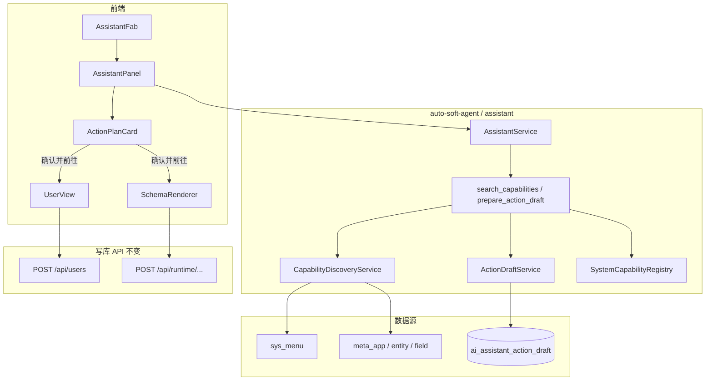
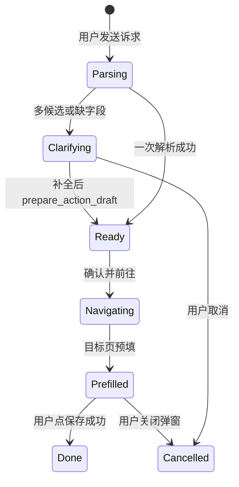

# 阶段 8：助手操作 Copilot（完整开发计划）

> 文档日期：2026-09-02  
> 对应总计划：[分阶段开发计划.md](./分阶段开发计划.md)  
> 前置：[阶段7-全局AI助手与记忆系统.md](./阶段7-全局AI助手与记忆系统.md)（FAB、SSE、只读工具、记忆已可用）  
> 实现规格：[spec/assistant-action-copilot.spec.md](./spec/assistant-action-copilot.spec.md)  
> 工期：P0 约 8～9 人天（含设计文档）  
> 目标：用户通过全局助手用自然语言描述操作诉求；系统**自动发现**目标功能、生成操作草稿、缺项追问；用户确认后**跳转目标页并预填**；**在目标页点保存**才写库。动态 CRUD **零 Admin 配置**；系统模块**代码注册**能力，无需「Action 管理」页。

---

## 1. 阶段目标

1. 扩展全局助手，支持 **操作类意图**（P0：`create` 新建）。
2. **运行时能力自动发现**：已发布动态应用/实体从 `meta_*` + 菜单自动生成 capability；新功能发布即可被助手操作，管理员无需配置 Action 目录。
3. **系统内置能力代码注册**：P0 注册 `system.user.create`；开发系统模块时在代码中声明一次，运维零配置。
4. **ActionDraft 流程**：解析用户话术 → 校验必填 → 缺项/未知字段在助手内追问 → 计划确认 → 跳转预填。
5. **两阶段确认**：助手内「确认并前往」+ 目标页「保存」；P0 不在助手内直接代提交 API。
6. 不破坏阶段 7 导航、操作历史、记忆、闲聊能力。

## 2. 本阶段明确不做

| 内容 | 说明 |
| --- | --- |
| 管理员「Action 管理」配置页 | P4 可选同义词；P0 不做 |
| 替代 Studio | 不改元数据、工作流 IR、不动态 DDL |
| 助手内一键代提交 | P0 固定目标页保存；P2+ 再评估 |
| update / delete / submit / 审批 | P1～P3 分期 |
| 低代码 PAGE 表单代填 | 交互非统一 CRUD，P2+ |
| LLM 拼 SQL / 绕过 Service | 写库必须经 `UserService`、`RuntimeService` |
| 修改他人数据 / 越权操作 | draft 绑定 `userId`，权限与页面按钮一致 |

### 相对阶段 7 的边界变化

- 阶段 7：助手 **只读**（导航、查 oper log、记忆）。
- 阶段 8：在 **不修改元数据/工作流 IR** 前提下，允许 **代操作用户数据与运行时 CRUD**，但写库仍由用户在目标页确认保存。
- 与 Studio 仍分离：Studio 建应用/schema；助手操作用户已发布功能或系统模块。

## 3. 前置条件

- 阶段 7 P0+P1 已落地：`AssistantService` SSE、`search_menus`、`AssistantPanel` FAB。
- Flyway 已到 `V2.0.0`（助手会话表）；编码前先有本文与 spec，编码时新增 `V2.2.0__assistant_action_draft.sql`。
- 系统用户模块与动态 CRUD 运行时可用（阶段 1～2）。
- OpenCode Go 与 `sys_llm_config` 已配置（与阶段 7 共用）。

## 4. 与现有能力对照

| | 功能开发 Studio | 阶段 7 助手 | 阶段 8 Copilot |
| --- | --- | --- | --- |
| 入口 | `/studio` | 右下角 FAB | 同 FAB |
| 主要能力 | 建 schema / 工作流 | 导航、查历史、记忆 | **+ 代操作（create）** |
| 能力来源 | ToolRegistry 元数据工具 | 菜单只读 | 菜单 + RuntimeSchema + 代码注册 |
| 新动态应用 | Agent 在 Studio 里建 | 只能导航到页 | **发布即自动可操作** |
| 写库 | 改 meta + 发布 | 禁止 | 目标页保存 → 现有 API |
| 确认 | ask_user + 发布按钮 | 无写操作 | 计划确认 + 页面保存 |



## 5. 核心概念

### 5.1 Capability（能力）— 隐式 Catalog

非管理员配置页，而是：

- **系统能力**：`SystemCapabilityRegistry` 启动时加载（`@AssistantCapability` 或 Java 配置类）。
- **动态能力**：`CapabilityDiscoveryService` 按当前用户可见菜单 + 已发布 `meta_entity` 实时生成。

ID 规范见 [spec §1](./spec/assistant-action-copilot.spec.md)。

### 5.2 ActionDraft（操作草稿）

一次「待执行操作」的中间态，持久化在 `ai_assistant_action_draft`：

- `values` / `displayValues` / `missing` / `unknown`
- 状态：`draft` → `ready` → `consumed` | `cancelled` | `expired`
- TTL：30 分钟（可配置 `autosoft.assistant.action-draft-ttl-minutes`）

### 5.3 两阶段确认（P0 固定）

| 阶段 | 位置 | 行为 |
| --- | --- | --- |
| 计划确认 | 助手 `ActionPlanCard` | 展示摘要；仅 `ready` 可点「确认并前往」 |
| 执行确认 | 目标页 Modal | 用户核对预填内容，点「保存」调用现有 API |

## 6. 能力发现设计

### 6.1 动态 CRUD（零 Admin 配置）

**数据源**：

- `MenuService.searchMine` — 路径 `/app/:app/:entity`
- `RuntimeService.schema` — `MetaFieldVO`（`requiredFlag`、`fieldType`、`optionsJson`）
- 权限：`app:{appCode}:{entityCode}:create`

**匹配步骤**（`CapabilityDiscoveryService`）：

1. 从用户话术提取关键词（实体中文名、应用名）。
2. 搜索当前用户可见菜单项 + 已发布 `meta_entity`（名称/code 模糊匹配）。
3. 对每个候选拉 schema，组装 `runtime.{app}.{entity}.create`。
4. 过滤无 `create` 权限的项。
5. 若 top 候选 score 接近 → 返回 `ambiguous`，Prompt 要求 `ask_user`。

**fieldType 映射**（meta → capability type）：

| meta fieldType | capability type |
| --- | --- |
| text, textarea | string |
| int | int |
| decimal | decimal |
| date, datetime | datetime |
| select, radio | enum |
| switch | bool |

### 6.2 系统内置（代码注册）

P0 仅一条：`system.user.create`

| 属性 | 值 |
| --- | --- |
| path | `/system/users` |
| permission | `system:user:create` |
| targetType | `system_modal` |
| modalKey | `userCreate` |
| api | `POST /api/users` |
| fields | 对齐 `UserCreateDTO`：username, password, nickname, roleIds, status |

**角色名解析**：用户说「管理员」→ 调 `RoleService` / options 映射为 `roleIds`，禁止 LLM 编造 ID。

**未知字段**：如用户说「年龄 25」→ `UserCreateDTO` 无此字段 → 进入 `unknown[]`，助手明确提示「用户模块不支持年龄」。

**扩展方式**：新增系统能力时在 `auto-soft-agent` 或对应模块增加 `@AssistantCapability` 定义，**开发期注册一次**，无需运维配置。

## 7. 后端设计

### 7.1 包结构

```
dev/auto-soft-agent/src/main/java/com/autosoft/agent/assistant/
  action/
    CapabilityDiscoveryService.java
    SystemCapabilityRegistry.java
    ActionDraftService.java
    ActionFieldValidator.java
    RoleNameResolver.java
    annotation/AssistantCapability.java
    model/CapabilityDefinition.java
    model/CapabilityField.java
    model/ActionDraftVO.java
    entity/ActionDraftDO.java
    mapper/ActionDraftMapper.java
    tool/impl/
      SearchCapabilitiesTool.java
      GetCapabilitySchemaTool.java
      PrepareActionDraftTool.java
      GetActionDraftTool.java
      AssistantAskUserTool.java
    web/AssistantActionController.java
```

Controller 零业务；编排仍在 `AssistantService`，工具内调 `ActionDraftService`。

### 7.2 Agent 工具（P0）

| 工具 | 说明 |
| --- | --- |
| `search_capabilities` | keyword + intent → 候选 capability |
| `get_capability_schema` | 返回字段定义 |
| `prepare_action_draft` | 解析 fieldValues，创建/更新 draft |
| `get_action_draft` | 续聊查询 |
| `ask_user` | 歧义或缺项澄清 |

参数与返回值见 [spec §4](./spec/assistant-action-copilot.spec.md)。

### 7.3 Prompt 与意图

**AssistantPromptBuilder** 增量规则：

1. 用户表达「添加/新建/创建/录入」且对象为系统功能或业务数据 → 操作意图，先 `search_capabilities`。
2. 「有没有/昨天/操作过」→ 仍走 `query_my_operations`，与 OPER 不混。
3. 禁止未调用工具时声称操作成功。
4. 缺必填必须 `ask_user` 或返回 `action_missing`，不得伪造 ready。
5. 仍禁止 Studio 元数据工具（`create_app` 等）。

**AssistantIntentHint** 增量：

- 含「添加、新建、创建、录入、帮我加、帮我建」且非「有没有新增过」→ `[意图提示] 用户可能要执行写操作，请使用 search_capabilities 与 prepare_action_draft。`

### 7.4 SSE 扩展

| event | 说明 |
| --- | --- |
| `action_missing` | 缺必填 / unknown 字段 |
| `structured`（type=`action_plan`） | ready 时展示计划卡片 |
| `ask_user` | 暂停等待用户回复 |

`AssistantService.extractStructuredPayload` 增加对 `action_draft` / `action_plan` 的识别。

### 7.5 安全与审计

- 每个 capability 校验 `LoginUser.hasPermission(permission)`。
- Draft 仅 `userId` 本人可读；绑定 `sessionId`。
- `password` 等 sensitive 字段：tool_log 脱敏；oper_log 不写明文。
- 保存成功后现有 `@OperLog`（如 `USER.CREATE`）自动记录。

## 8. API

P0 新增（详见 spec §6）：

| 方法 | 路径 | 说明 |
| --- | --- | --- |
| GET | `/api/assistant/capabilities/search` | 可选调试接口 |
| GET | `/api/assistant/action-drafts/{id}` | 获取 draft |
| POST | `/api/assistant/action-drafts/{id}/consume` | 页面消费后标记 |
| POST | `/api/assistant/action-drafts/{id}/cancel` | 取消 |

现有 `POST /api/assistant/sessions/{id}/chat` SSE 不变。

写库仍用：

- `POST /api/users` — `UserController`
- `POST /api/runtime/{app}/{entity}` — `RuntimeController`

编码完成后更新 [api.md](./api.md)、[database.md](./database.md)。

## 9. 前端设计

### 9.1 组件与 Store

```
web/src/stores/assistantAction.ts          # Pinia draft 传递
web/src/components/assistant/
  ActionPlanCard.vue                       # 计划摘要 + 确认并前往
web/src/api/assistant.ts                 # SSE 类型 + draft REST
web/src/components/assistant/AssistantPanel.vue      # 处理 action_* 事件
web/src/components/assistant/AssistantMessageItem.vue  # 渲染 action_plan
```

### 9.2 ActionPlanCard 交互

- 展示：目标功能名、targetPath 摘要、已填字段（displayValues）、missing（红色）、unknown（灰色说明）。
- `canConfirm === false`：禁用「确认并前往」。
- 「确认并前往」：`assistantActionStore.setPending(draft)` → `router.push(targetPath)` → 关闭 Drawer。
- 「取消」：清 store + 可选调用 cancel API。

### 9.3 目标页 Draft 协议

**系统用户 — `web/src/views/system/user/UserView.vue`**：

- `onMounted`：`assistantActionStore.consume('system.user.create')`
- 有 draft：`openCreate()` + 映射 `editForm` + `postConsume(draftId)`
- missing 非空：`message.warning` 提示用户补全

**动态 CRUD — `web/src/components/schema/SchemaRenderer.vue`**：

- 新增 `openCreateWithDraft(values)` 方法
- `RuntimePageView` 或 SchemaRenderer `onMounted` 消费 `runtime.{app}.{entity}.create`
- 权限：`can('create')` 不通过则不打开

Draft 经 **Pinia store** 传递，URL 不携带 password。

### 9.4 交互状态机



## 10. 端到端示例

### 10.1 系统用户新建

**用户**：在用户模块添加一个用户 A，角色管理员，年龄 25  

**系统**：

1. `search_capabilities("用户", create)` → `system.user.create`
2. `prepare_action_draft` → nickname=A, roleIds=[ADMIN], unknown=[age], missing=[username, password]
3. SSE `action_missing` + 文本说明
4. **用户**：用户名 user_a，密码 Abc12345
5. `prepare_action_draft`（续聊 draftId）→ status=ready
6. `structured` action_plan → 用户点「确认并前往」
7. 跳转 `/system/users`，新建弹窗已预填
8. 用户点「保存」→ `POST /api/users`

### 10.2 动态 CRUD 新建

**用户**：帮我在请假单里加一条，请假天数 3，原因家里有事  

**系统**：

1. `search_capabilities("请假", create)` → `runtime.leave.leave.create`
2. 按 schema 映射 `days=3`, `reason=家里有事`
3. ready → 确认并前往 → `/app/leave/leave`
4. SchemaRenderer 打开新增并预填 → 用户保存

## 11. 任务拆解与工期

| 任务 | 内容 | 工期 |
| --- | --- | --- |
| P0-1 | 设计文档 + spec + 索引更新 | 1d |
| P0-2 | Flyway draft 表 + ActionDraftService + SystemCapabilityRegistry | 1.5d |
| P0-3 | CapabilityDiscovery（runtime 自动）+ search 工具 | 1.5d |
| P0-4 | prepare/get 工具 + Prompt/IntentHint + SSE | 1.5d |
| P0-5 | ActionPlanCard + assistantAction store + UserView | 1d |
| P0-6 | SchemaRenderer draft 预填 | 1d |
| P0-7 | 验收话术 + 边界 case | 1d |

**P0 合计约 8～9 人天。**

### 后续分期

| 分期 | 内容 |
| --- | --- |
| P1 | runtime update；cancel_action_draft；draft 续聊优化 |
| P2 | runtime submit；流程相关操作 |
| P3 | system.user update/roles/status |
| P4 | 可选：同义词/别名配置（非必须） |

## 12. P0 验收清单

- [ ] 「在用户模块添加用户 A，角色管理员」→ 识别 `system.user.create`，追问 username/password
- [ ] 补全后 ActionPlanCard → 确认并前往 → UserView 弹窗预填 → 保存成功
- [ ] 话术含「年龄 25」→ unknown 提示，不写入表单
- [ ] 已发布请假单：「添加一条请假，天数 3」→ 自动发现 runtime → SchemaRenderer 预填 → 保存成功
- [ ] 无 `system:user:create` 权限 → 403 文案，不跳转
- [ ] 「用户管理」与某 app 实体同名 → ask_user 澄清
- [ ] Draft 过期 → 提示重新描述
- [ ] 「用户管理在哪里」仍返回 nav_link（阶段 7 不回归）
- [ ] 「我昨天有没有新增过用户」仍查 oper log（不与 ACTION 混淆）

## 13. 风险与对策

| 风险 | 对策 |
| --- | --- |
| LLM 字段映射错误 | ActionFieldValidator 白名单；missing/unknown 显式返回 |
| ACTION 与 OPER 混淆 | IntentHint + Prompt 分流；「有没有」走 oper log |
| 系统页与 runtime 歧义 | ambiguous + ask_user |
| UserView 与 SchemaRenderer 两套 UI | 统一 Draft 协议 + targetType 分支消费 |
| 敏感字段泄露 | store 短期持有；log 脱敏；禁止 URL 传参 |
| 阶段 7 Prompt 冲突 | 增量规则，保留只读工具 |

## 14. 交给后续编码 / 文档的接口

- **编码前请先读** [阶段8-助手操作Copilot-开发设计.md](./阶段8-助手操作Copilot-开发设计.md)（类清单、方法签名、改造点、编码顺序）。
- 实现时更新 [database.md](./database.md)（`ai_assistant_action_draft`）、[api.md](./api.md)、[user-guide.md](./user-guide.md)（助手代操作说明）。
- 在 [spec/README.md](./spec/README.md) 增加本 spec 索引；编码冻结后可写 As-Built 补充。
- 配置项：`autosoft.assistant.action-draft-ttl-minutes`（默认 30）写入 `application-dev.yml` 说明。

## 15. 附录：验收话术

| 用户输入 | 期望行为 |
| --- | --- |
| 在用户模块添加用户 A，角色管理员 | 识别 system.user.create，追问用户名密码 |
| 用户名 user_a 密码 Abc12345 | draft ready，可确认并前往 |
| 添加一条请假，天数 3 | 发现 runtime.leave.*.create，跳转预填 |
| 用户管理在哪里 | 仍返回 nav_link（阶段 7） |
| 我昨天有没有新增过用户 | 仍查 oper log（阶段 7） |
| 帮我做一个请假单应用 | 引导去 /studio |
| 年龄 25（在用户新建语境） | unknown 提示，忽略该字段 |
